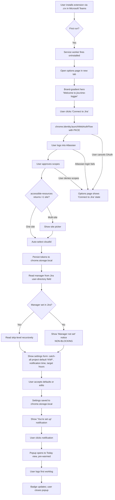
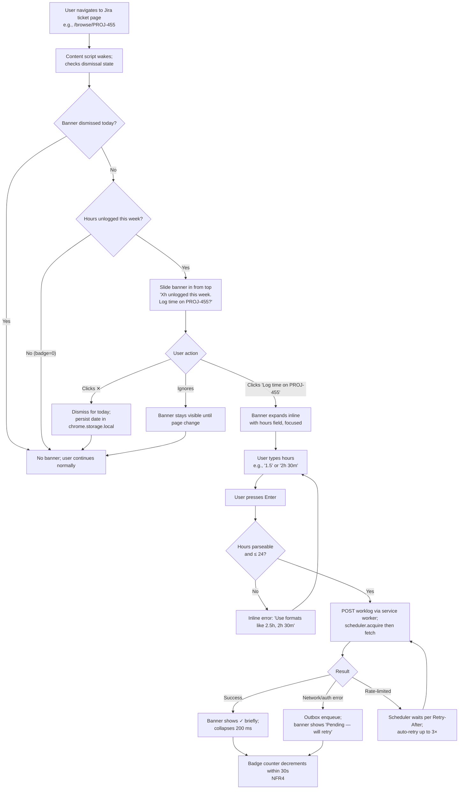
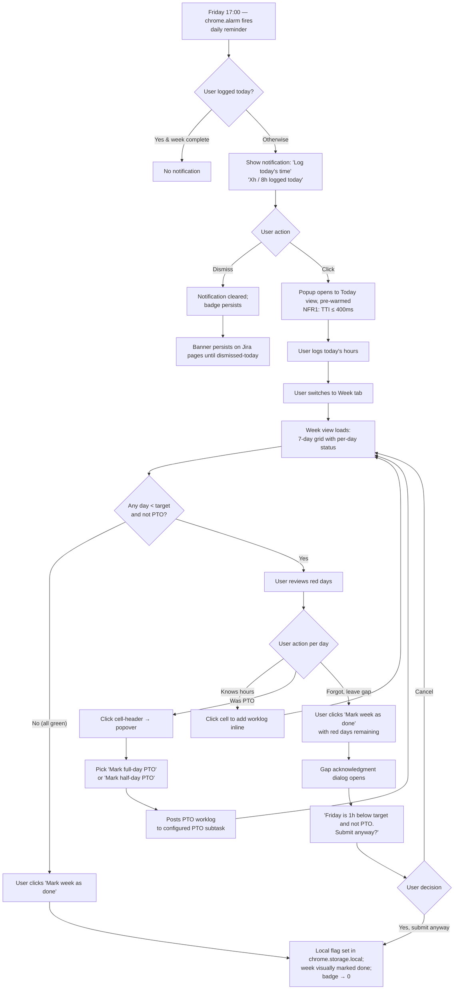

# UX Design Specification jira-time-logger

**Author:** Note
**Date:** 2026-05-10

---

<!-- UX design content will be appended sequentially through collaborative workflow steps -->

## Executive Summary

### Project Vision

**jira-time-logger** is a Manifest V3 Chrome extension that transforms Jira's worklog from a passive form people forget into an ambient, behavior-changing tool. It serves a small dev team (~10 users) with two co-equal value propositions: **active reminders** (badge counter + inline Jira banner + daily push notification) and **at-a-glance overview** (weekly grid + monthly manager matrix). Removing either half collapses the product back to "just use Jira directly."

The product is bespoke for the team's specific workflow — subtask-only logging, KNP catch-all project, monthly manager approval feeding accounting — and ships serverless (Chrome extension + Jira Cloud only, no backend).

### Target Users

**Worker — Priya (primary user):** Senior engineer, 4 years at the org. Logs sporadically today; forgets for days, then guesses at month end. The native Jira worklog UI is too click-heavy and hides her daily totals. She's tech-savvy, lives in Chrome on a desktop, opens Jira many times a day, and wants the timesheet ritual to take seconds, not minutes. Her relief moment is *"oh, I haven't logged Wednesday — wait, the tool already knows the tickets, I just confirm."*

**Manager — Marco (secondary user):** Engineering manager with 7 direct reports (including Priya). Approves monthly timesheets that feed accounting. Today spends ~3 hours each month chasing people and spot-checking individual entries. He's the same tech-savvy as Priya but values speed-to-decide more than visual depth. He needs a 2D matrix with red/green cells he can scan quickly; he drills down *only* on cells that look wrong.

**Dual-persona reality:** Marco is also a Worker — he logs his own time. The same extension serves both modes for him; the popup must make the role-switch obvious within the first 200 ms of opening.

### Key Design Challenges

1. **Three coordinated surfaces, three different interaction contracts.** The toolbar popup is *ephemeral* (60-second tasks; no onboarding, no settling-in time). The content-script banner is a *guest* inside Jira's UI (must respect Jira's visual language; can be dismissed; cannot be ignored permanently). The options page is the only *patient* surface. Each surface needs its own design vocabulary.

2. **Dual-persona role switching in the popup.** Worker mode and manager mode are different jobs with different information density. The mode switch must be unmissable but not annoying. Worker mode is the default; manager mode is opt-in (only visible to users with reports).

3. **Discovery-of-gap → instant relief.** The product's "ah-ha" moment is the user discovering they're behind (badge or banner) and immediately resolving it (popup pre-filled). The transition from gap-discovered to gap-resolved must feel like one fluid action, not two. Total time from notification-tap to worklog-posted should target <60 s.

4. **Gap acknowledgment dialog without making the user feel judged.** When a worker marks a sub-target day as "done," they acknowledge the gap. This is a moment of friction with outsized emotional weight. Too punitive → users resent the tool. Too easy → meaningless rubber-stamp. Must be honest but not preachy.

5. **Manager matrix progressive render.** Up to 12 reports × 50 Epics = 600+ data points fetched client-side over Jira's rate-limited API. The UI must render *useful information first* (first row in 2 s) without waiting for the full grid. Loading skeletons, not spinners.

6. **Accessibility floor (NFR12-13).** Keyboard navigation, visible focus, color-not-sole-signal — all baked into shadcn/ui Radix primitives by default but require discipline in our own compositions. The banner specifically uses inline styles only (Jira's CSP), so we can't lean on Tailwind's auto-extracted classes for that surface.

7. **Performance constraint as a UX constraint.** Popup time-to-interactive ≤ 400 ms (warm) / 800 ms (cold). This forbids large client-side animations on popup open and pushes us toward pre-warmed data and minimal initial render trees.

8. **Logging against tickets *outside* the hierarchy walk.** The pre-fill picker (FR8) shows tickets assigned via the worker's reporting line, but workers regularly need to log against tickets *not yet assigned* to them — a teammate's task they helped with, a new project they were pulled into mid-week before assignments updated, a code-review subtask under a peer's task. The picker must accommodate **search-and-add**: the worker can find any Task by key or text, add it to their personal picker, and from then on it's surfaced alongside hierarchy-walked tickets. Once added, the worker uses the standard "+ Create my subtask under this Task" affordance to log against it. *Implementation note — this is a UX-driven extension to FR8: add a "Search Jira" entry point in TicketPicker, and a personal "recently used / pinned tickets" list in `chrome.storage.local`.*

### Design Opportunities

1. **The badge is the canvas for ambient awareness.** A single number on the toolbar icon, visible every time the user looks at the browser. Its design budget is ~10 px square but its impact is constant. Treat it as the most important pixel in the product.

2. **The inline Jira banner converts already-visited Jira pages into logging triggers.** When a worker is looking at the very ticket they worked on this morning, the banner can offer "log time on THIS ticket" — collapsing intent and action. This is the one place the tool reaches into the user's existing workflow rather than asking them to switch context.

3. **The weekly grid as a visual diary.** Color-coded per-day cells with hours showing make the week scannable in one glance. Red Monday, green Tuesday — Priya can see the shape of her week without reading numbers. This is a primary mental model the tool can make better than Jira ever has.

4. **The manager matrix as a calm dashboard.** Most cells are green most of the time. The cognitive work for the manager is in the exceptions — the 2 cells that are red, the 1 that is yellow-striped. Design the matrix so the exceptions visually pop without making the greens feel ignored.

5. **The "Mark as Done" button as a relief moment.** Friday afternoon, the worker confirms the week is whole, hits Mark as Done, and the badge drops to zero. That moment of "I'm good for the week" is satisfying — design the button affordance and the post-action confirmation to honor it.

## Core User Experience

### Defining Experience

The product has **two co-equal core actions**, each owned by a different persona:

**Worker core action — "log time without thinking":** Open the popup (or click the inline banner), pick a subtask from the pre-filled list, type hours, hit Enter. Median time: ≤ 30 seconds. The worker does this many times per week and must never feel friction beyond what the task strictly requires.

**Manager core action — "approve the month":** Open the manager view, scan the matrix for red/yellow cells, drill into anomalies, click "Approve" for each report. Median time per report: ≤ 5 minutes. The manager does this 12× per year and must feel they made an informed decision, not a rubber-stamp.

The product's **core loop binding both** is *discovery → resolution*: the user discovers a gap (badge, banner, push notification, or open matrix cell) and resolves it (pre-filled form, one-click approve) within one tight session. Friction in either half — discovery or resolution — collapses the loop.

### Platform Strategy

**Single platform: Chromium browser extension (Manifest V3).**

- Targets: Chrome (primary), Edge (primary). Firefox/Safari deferred.
- Input: keyboard + mouse. No touch, no voice, no gesture.
- Form factors: desktop only (the popup is sized for a 360×600 px toolbar dialog; the options page is desktop-width). No responsive mobile scaling — the extension simply doesn't run on mobile Chrome.
- Offline: graceful degradation only. The tool surfaces an explicit offline state; outbox queues writes; nothing silently fails.
- Network: assume corporate network with low-latency Jira Cloud access; design for the case where Jira is occasionally rate-limited but not unreachable.
- Browser storage: `chrome.storage.local` (10 MB) and `chrome.storage.session` (cleared on browser close).

### Effortless Interactions

These must feel like nothing — zero conscious thought required:

1. **Opening the popup from a daily reminder.** Notification → click → popup is *already loaded* with today's view. Pre-warmed by the service worker; no spinner, no "loading…" text. Target: TTI ≤ 400 ms.
2. **Picking a ticket from the pre-fill list.** The list is sorted by likelihood (most-recently-touched first). The worker recognizes the right ticket within 2 seconds without reading every line. Search is available but rarely needed.
3. **Typing hours and submitting.** Number input with hour-decimal defaults (1.5, not 1h 30m). Enter submits. No "Save" button ceremony.
4. **Dismissing the inline banner.** Single click on an X icon. The banner stays gone for the day; reappears tomorrow. No confirmation dialog, no "Are you sure?".
5. **Marking a day as PTO.** Click the day-cell header in the weekly grid → popover with two buttons (Full / Half) → click → cell turns green. No modal, no form, no settling-in.
6. **Switching between worker and manager modes.** A clearly-labeled tab/toggle near the top of the popup. One click; no transition, no loading state. Worker mode is the default; manager mode is only visible to users who actually have reports.
7. **Reading the badge counter.** The number on the toolbar icon tells the worker "you owe X hours this week." No interpretation, no decoding.

These should NOT be effortless — they're allowed to be deliberate:

- **First-time setup.** Connect to Jira (OAuth), pick a Jira site if multiple, configure the catch-all project. This is a one-time patient-mode experience on the options page; full keyboard nav, clear field labels, no time pressure.
- **Marking a week as done with gaps.** Gap acknowledgment dialog forces the worker to read what's missing and confirm. This is intentional friction protecting data integrity.
- **Approving a cycle as a manager.** A confirmation step with a summary of what's being approved (X hours across Y Epics for person Z). This is the moment that feeds accounting; deliberate is correct.
- **Approving a cycle that has visibility-restricted worklogs.** Manager sees the warning, must explicitly proceed. Captured in approval comment metadata for audit.

### Critical Success Moments

These are the make-or-break moments that determine whether the user adopts the tool or abandons it:

1. **First successful log within 60 seconds of install.** From "I just installed this" to "I logged my first hour" — if this isn't under a minute, the tool feels like overhead. Onboarding is the options-page configuration plus the first popup opening; the pre-fill list must be populated by then.
2. **The first banner-driven log.** The first time the worker is on a Jira ticket they actually worked on, the banner offers contextual quick-log, and the worker uses it. This is the ah-ha moment that makes the tool feel intelligent rather than intrusive.
3. **The first weekly review that catches a gap.** Friday afternoon, the worker opens the week view, sees a red Wednesday they'd forgotten about, fills it in 30 seconds. This validates the review-tool half of the value proposition.
4. **The first manager approval that takes < 10 minutes total.** The manager opens the matrix, sees most cells green, drills into 1-2 outliers, clicks Approve for each report. Comparing to their previous half-day chore, this is the ROI moment for the manager.
5. **The 30-day mark with no re-auth.** OAuth refresh has worked silently; the worker has not been prompted to reconnect once. This is the trust moment that makes the tool feel reliable.
6. **The first dirty-edit detection.** A worker edits a worklog after the cycle was approved; the manager view shows the yellow-stripe; re-approval works. This validates the audit-integrity backbone.

### Experience Principles

These principles guide every UX decision in this spec:

1. **Frictionless on the hot path; deliberate on the cold path.** Logging time (frequent) must be friction-free. Approving a cycle (rare, high-stakes) is allowed to be deliberate. Setup (one-time) is allowed to be patient.
2. **The tool reaches the user, not the other way around.** Badge, banner, push — the tool surfaces itself. The user should never need to remember to open the popup. (Inverse: don't be annoying; one daily push, one daily-dismissable banner, an always-visible but quiet badge.)
3. **Show the gap, don't lecture about it.** Red cells, missing numbers, an honest acknowledgment dialog — these communicate the gap without judgment. Avoid copy that sounds preachy ("Don't forget!", "You should…").
4. **Honest data over polished data.** When the manager view can't see all worklogs (visibility restrictions), say so. When the parser can't read a comment, say so. When the network is down, say so. Never silently misrepresent.
5. **The manager's time is the most expensive.** Every manager interaction is paid in skipped engineering work. Optimize the manager view for fewest-clicks-to-confidence above all else.
6. **Worker mode is the default; manager mode is the modifier.** When in doubt about what to show on popup open, show the worker view. Manager mode is opt-in via a clearly-labeled toggle, only visible when the user actually has reports configured in Jira.
7. **Graceful degradation, not blocking errors.** If catch-all is not configured, hide the catch-all column. If manager isn't set in Jira, the picker shows fewer suggestions but still works. If Jira is unreachable, queue and retry. Never block the core "log my time" flow.

## Desired Emotional Response

### Primary Emotional Goals

The product targets **two primary emotions per persona**, plus a shared **dominant tone** across all surfaces.

**Worker (Priya) should feel:**

- **Relief.** "I was behind, and now I'm not." This is the discovery → resolution loop's emotional payoff. The badge dropping from `12h` to `0h`, the red Wednesday turning green — these are not decorative state changes, they are emotional rewards.
- **Quiet competence.** "I'm on top of my work." Not pride, not achievement — just the absence of the low-grade anxiety that comes from suspecting you're behind on logging.

**Manager (Marco) should feel:**

- **Confidence in the data.** "I know what I'm approving and I know it's accurate." The honesty principle (visibility warnings, dirty-detection, fail-closed parser) earns this; the matrix visual hierarchy reinforces it.
- **Efficient ownership.** "I made informed decisions in 11 minutes, not three hours." Time saved is the primary emotional ROI for the manager — and the matrix design must constantly signal "you are being respected."

**Shared dominant tone — across both personas, every surface:**

- **Calm, honest, quietly competent.** Like a good colleague who hands you a complete report and steps out without commentary. Not cheerful, not stern, not corporate. Just present, accurate, and tastefully out of your way.

### Emotional Journey Mapping

| Moment | Worker emotional state | Manager emotional state |
|---|---|---|
| First install / OAuth connect | Slight curiosity, mild suspicion ("is this going to work?") | Same |
| First popup open after install | Pleasant surprise — "oh, it already knows my tickets" | Same |
| Daily badge glance (everyday) | Background awareness — quiet "how am I doing?" check | Same |
| Daily push notification fires | Mild prompt — "right, I should look at this" — NOT guilt | Same |
| Banner appears on Jira ticket page | Helpful nudge — "and I'm on the right ticket already" | Same |
| Logging a single worklog | Frictionless — should feel like nothing happened, no friction-tax | Same |
| Friday weekly review | Mild satisfaction reviewing the week visually | Same |
| Mark-as-done with a complete week | Quiet relief, small reward — "good week, done" | Same |
| Mark-as-done with gaps acknowledged | Honest reckoning — neither congratulated nor scolded | Same |
| Manager opens monthly matrix Day 1 | (n/a) | Slight focus shift — "this is the part of the month I do this" |
| Manager scans matrix and sees mostly green | (n/a) | Confidence — "team is mostly fine; let me look at exceptions" |
| Manager drills into a red cell | (n/a) | Curiosity, not suspicion — "let me see what happened here" |
| Manager clicks Approve | (n/a) | Brief moment of weight ("this feeds accounting") then satisfaction |
| Something goes wrong (auth expired, Jira down) | Inconvenience — but trust survives because the error is honest and the retry happens | Same |
| 30 days in, no re-auth | Background trust — "this just works" | Same |

### Micro-Emotions

These subtle states are what we deliberately design for or against:

| Promote | Suppress |
|---|---|
| Confidence (in the data) | Anxiety (about whether logging is right) |
| Trust (in the tool) | Skepticism (about whether the tool helps) |
| Quiet accomplishment | Performative achievement (no badges, no streaks in v1.0) |
| Calm focus | Distraction (animations should add polish, not steal attention) |
| Honest acknowledgment | Judgment (no "you forgot!" copy) |
| Efficient closure | Decision fatigue (one big approve button, not 12 small confirms) |
| Mild relief at gap-resolved | Guilt at gap-discovered |

### Design Implications

How emotional goals translate to specific UX choices:

| Emotion | UX choice |
|---|---|
| **Relief** | Badge counter visibly drops to 0 when the user catches up. The grid cell flips from red to green with a satisfying ~200 ms transition. The full-week-clean state can be celebrated with a subtle moment (a small chip animation, a soft confirmation flourish on Mark-as-Done). |
| **Quiet competence** | No streaks, no badges, no XP in v1.0. The badge counter shows missing hours, not "current streak" or "logged days this month." Achievement is internal, not surfaced. *(See post-MVP gamification note below.)* |
| **Confidence in data (manager)** | Visibility warnings always shown when applicable. Dirty cells visually distinct from clean cells. Approve dialog summarizes exactly what's about to be approved. |
| **Efficient ownership (manager)** | Matrix renders progressively (first row in 2 s); rows can stagger-fade in as data resolves (~150 ms per row) for visual rhythm. Approve is a single click; confirmation is a one-line summary, not a multi-step wizard. |
| **Calm tone everywhere** | Color palette skews neutral (see Visual Foundation step). Red cells use a desaturated red, not alarming red. Greens are sage, not Slack-mention green. Whitespace is generous. |
| **Honest, not preachy copy** | Notification copy: *"Log today's time"* — not *"Don't forget!"*. Banner copy: *"6h unlogged this week"* — not *"You're behind!"*. Gap acknowledgment dialog: *"3 days are below 8h and not marked as PTO. Submit anyway?"* — not *"Are you sure you want to submit incomplete data?"*. |
| **Polished but quiet animations** | Tasteful motion is welcome where it helps — popup-open fade (≤ 150 ms), cell color transitions (≤ 200 ms), banner slide-in on Jira page load, button hover states, matrix-row stagger reveal. Animations must respect the popup TTI budget (NFR1: 400 ms warm); nothing blocks first paint or first interaction. |
| **No gamification in v1.0; revisit post-MVP** | Streaks, achievement badges, "X weeks on time" markers, etc. are deferred. Once v1.0 is in real use, we'll see what natural success feels like to the team and design gamification around that signal — see Post-MVP Gamification note below. |
| **Errors feel like the tool admitting limits, not failing** | Error copy: *"Can't reach Jira right now — your worklog will post when we're back online."* Past-tense and active voice ("will post"), no apology theatre. |

### Post-MVP Gamification (deferred)

Gamification is interesting for this product but should not be designed before we have evidence of how teammates *naturally* feel about adoption. Candidates to revisit in v1.x once v1.0 is in real use:

- **Streak counters** — "logged on time 8 weeks in a row" — surfaced in options page or a small persistent badge in the popup, not pushed to the user
- **Quiet milestone markers** — "first month with all reports approved by day 3" — a discrete chip, not a fanfare
- **Team-level signals (opt-in)** — "your team's average days-to-log this month" without naming individuals
- **Manager-side completion indicator** — "X of Y reports approved; Z remaining" with a quiet progress bar

The principle when we add these: gamification must amplify the *quiet competence* emotion already designed for. Never "you're behind your team" framings; never leaderboards; never anything that could create cross-team comparison anxiety.

### Emotional Design Principles

These are the binding emotional rules for every UX decision in v1.0:

1. **The tool's emotional posture is colleague, not coach.** It provides information; it doesn't motivate, congratulate, or admonish. It treats the user as a competent adult.
2. **Relief beats reward.** Users feel good because a problem went away, not because the tool gave them a sticker. (Until post-MVP gamification, where any reward we add must amplify relief, not replace it.)
3. **Honesty earns trust; politeness erodes it.** "Can't reach Jira" is more reassuring than "Oops! Something went wrong. We're sorry!" because it tells the user what's actually happening. Apology theatre suggests the tool is hiding something.
4. **Friction is a respect signal, not a punishment.** The gap acknowledgment dialog has friction because the data matters, not because we're scolding the worker. Frame all friction as "the tool is treating this as serious because you should too."
5. **The manager's confidence is purchased with the worker's honesty.** Every visibility warning, every dirty indicator, every fail-closed comment parser exists so the manager can approve confidently. This earns the manager's trust in the tool, which earns their adoption, which makes the tool useful to the worker. The chain of trust matters.
6. **Tasteful motion that earns its weight.** Animations are welcome where they add polish or convey meaning (cell color transitions, badge updates, banner slide-in, popup fade-in). They must never block first paint, never exceed ~200 ms unless triggered by deliberate user action (e.g., a Mark-as-Done confirmation flourish), and never run while the user is trying to act on the surface.
7. **No surface speaks unless it has something to say.** Empty states are honest empty states ("No tickets in your hierarchy. Search Jira to add one."). Loading states are skeletons, not spinners. Success states are absence (the form closes, the badge drops). Quiet beats noisy on every surface.

## UX Pattern Analysis & Inspiration

### Inspiring Products Analysis

**1. Linear (web app + extension)**
- *What they nail:* Calm visual register; honest dense typography; the "command-K" muscle memory for power users; status pills that communicate state without color alone (icon + label + color); fast list/table interactions; quiet success states (item disappears rather than green-checks at you).
- *What we borrow:* The whole calm-utilitarian register. Dense information hierarchy without clutter. Minimal use of gradients, shadows, decorative imagery.
- *What we don't borrow:* Linear's keyboard-first density would be too much for a 60-second popup task; we still need clear visual affordances for mouse users.

**2. Raycast (macOS launcher + extension store)**
- *What they nail:* Popup-style ephemeral UI that feels powerful without being overwhelming. Per-row color accents that read as metadata, not decoration. Excellent empty states. Fast keyboard nav with visible mouse fallback.
- *What we borrow:* Popup interaction model — focus on first input immediately, ESC to close, Enter to submit. Per-row affordances that reveal on hover but don't require it.
- *What we don't borrow:* Raycast's deep-keyboard ethos; our users are mouse-first.

**3. Stripe Dashboard (web)**
- *What they nail:* Tabular financial data presented honestly. Clear loading skeletons. Row-level state (paid / pending / failed) with icon + color + text label combined. Drill-down panels that slide in rather than navigating away.
- *What we borrow:* Manager matrix design language — financial-grade clarity for the cells, drill-down panel pattern, skeleton loading, honest empty states ("No reports found in this cycle").
- *What we don't borrow:* Stripe's full-page web density; we're constrained to a 360 px popup width.

**4. GitHub native UI (issue/PR pages, action runs)**
- *What they nail:* Inline status indicators (green check / red X / yellow dot) that work for color-blind users via shape difference. Honest progressive load (rows render as data arrives). Quiet hover-reveals.
- *What we borrow:* Status-icon language for the matrix cells. Progressive row-by-row render pattern. Hover-reveal of secondary actions on cells.

**5. Notion Web Clipper (Chrome extension popup)**
- *What they nail:* Popup pre-warmed with relevant context (current page title pre-filled). Lives entirely inside the popup — one-and-done, no follow-up tab. Visible OAuth status indicator with one-click reconnect.
- *What we borrow:* Pre-warmed popup pattern; one-and-done interaction; OAuth-status indicator in popup.
- *What we don't borrow:* Their over-reliance on cloud sync for state (we're serverless).

**6. The Vercel deploy notification (browser-system notification)**
- *What they nail:* Notification copy is informational, not alarming. "Deployment ready" is past-tense action. Click to open the relevant surface, no other interaction needed.
- *What we borrow:* Notification copy register — past-tense, no exclamation marks, no apology theatre. Single-click takes the user to the actionable surface.

**7. jira-assistant (the reference project itself)**
- *What they get right:* Multi-surface extension architecture works in production over years. Calendar integration is genuinely powerful for users who have it.
- *What we deliberately don't borrow:* The kitchen-sink feature surface. jira-assistant tries to do everything; we do five things well. Their dashboard customization is a UX and maintenance burden we explicitly avoid.

### Transferable UX Patterns

**Navigation Patterns:**

- *Tab-based primary navigation in popup* (Linear, Raycast) — Today / Week / (Manager) tabs at the top, persistent across popup opens.
- *Drill-down sliding panel for detail* (Stripe Dashboard) — manager drill-down doesn't navigate away; it overlays.
- *No back button needed inside popup* — the dialog is small enough that browsers/users use the close button.

**Interaction Patterns:**

- *Pre-warmed popup with focus on first input* (Raycast, Notion) — cursor is in the hours field on Today view open; user can type immediately.
- *Enter to submit, ESC to close, no Save button ceremony* (Linear, Raycast) — frictionless for power users.
- *Click-cell-header popover* (custom pattern; close to GitHub's date-picker overlay) — better than right-click for discoverability.
- *Inline edit of grid cells* (Stripe, Linear) — click cell to edit hours; tab to next cell.
- *Ghost-prefilled context* (Notion clipper) — banner detects which Jira ticket page you're on and offers it as the default.
- *Hover-reveal of secondary actions* (GitHub, Linear) — drill-down caret, edit icons appear on row hover.

**Visual Patterns:**

- *Status pills with icon + label + color* (Linear, GitHub) — cell coloring backed up by a small icon indicator + tooltip. Solves NFR12 (color-not-sole-signal).
- *Skeleton loaders with row-level granularity* (Stripe, GitHub Actions) — matrix renders empty rows immediately, fills row by row.
- *Honest empty states* (Linear, Raycast) — text explaining what to do next, optionally a link.
- *Generous whitespace; quiet typography hierarchy* (Linear, Stripe) — text-size differences carry hierarchy more than color or weight.
- *Single accent color used sparingly* (Linear's purple, Raycast's red) — most of the UI is grayscale; the one accent color marks primary actions.

### Anti-Patterns to Avoid

These come up repeatedly in productivity-tool design and we explicitly reject them:

1. **Apology-theatre error states.** "Oops! Something went wrong!" with a sad face. Treats users as fragile. Hide the actual error. We use honest copy: "Can't reach Jira right now."
2. **Spinning loading wheels for everything.** Spinners say "I don't know how long this will take" — fine for a 200 ms button click, terrible for a 9-second matrix load. We use skeletons that hint at the eventual structure.
3. **Confetti / celebration animations.** Users logging time don't want a party. They want to be done. (Reserved for post-MVP gamification, where it would be discrete and contextual.)
4. **Multi-step modal wizards for simple actions.** "Step 1 of 3: Choose project. Step 2 of 3: Enter hours. Step 3 of 3: Confirm." We do one form, all fields visible, Enter submits.
5. **Persistent toast notifications that pile up.** Toasts for every successful action, especially from a popup that closes anyway, are noise. We use absence (form closes, badge drops) to signal success.
6. **Color-only state communication.** Red cell + nothing else excludes color-blind users. Every colored signal is accompanied by an icon, label, or pattern. (NFR12.)
7. **Hidden / mystery-meat navigation.** Hamburgers, kebabs, "more options" without context. In a 360 px popup, every navigation element has a label or an obvious icon.
8. **Onboarding tours / coachmarks on every screen.** Users will figure it out from clear empty states and field labels. We do one welcome notification on first install, then nothing.
9. **Forced opinions about layout.** Manager view doesn't let users choose between "compact" and "comfortable" density. One well-considered density. Less to maintain, less for users to decide.
10. **Background polling that wakes the device.** `chrome.alarms` is for scheduled work, not constant heartbeat. We poll only when the popup opens, when the badge cadence fires, and when a Jira page is visited.

### Design Inspiration Strategy

**What to Adopt (use as-is):**

- *Linear's calm typography hierarchy* — type-size + weight differences drive structure; minimal color usage.
- *Stripe Dashboard's drill-down panel pattern* — manager matrix drill-in is a slide-in panel.
- *Notion Web Clipper's pre-warmed popup with focused-on-open pattern* — popup opens with cursor in the hours field.
- *GitHub's progressive row render with skeleton placeholders* — manager matrix renders row by row.
- *Vercel notification copy register* — past-tense, informational.

**What to Adapt (modify for our context):**

- *Raycast's keyboard-first ethos → mouse-friendly with keyboard support* — our users are mouse-primary; keyboard is enhancement.
- *Linear's command-K → simple search input in TicketPicker* — same mental model, simpler implementation.
- *Stripe's wide tabular layout → 360 px-constrained matrix with horizontal scroll if needed* — we may need to constrain Epic count visible by default (top-N) with a "show all" affordance.
- *Notion Clipper's cloud-sync indicator → local OAuth status chip* — same affordance, no cloud.

**What to Avoid (explicit non-adoptions):**

- *jira-assistant's customizable dashboard widgets* — out of scope; one well-designed matrix beats N user-arranged views.
- *Notion's database UI complexity* — way too dense for our 60-second popup task.
- *Stripe's marketing-grade visual polish* — we aim utilitarian; no hero illustrations, no gradient backgrounds.
- *Linear's heavy keyboard-shortcut surface* — discoverable mouse affordances first; shortcuts are a power-user enhancement.
- *Slack's notification volume* — one daily push, that's it.

## Design System Foundation

### Design System Choice

**Tailwind CSS v4 + shadcn/ui**, with **Radix UI primitives** as the accessibility backbone. Categorically a *Themeable System* — strong foundation, full customization control, no runtime dependency on a component library.

### Rationale for Selection

The choice is locked at the architecture level (Step 4 of the Architecture document). Restated here from the UX perspective:

1. **shadcn/ui is not a dependency — it's a code generator.** We `pnpm dlx shadcn@latest add <component>` and own the source. No library lock-in, no runtime overhead, no breaking-change migrations from upstream. We can edit each component freely.
2. **Radix UI primitives ship accessibility by default.** Focus trapping, keyboard navigation, ARIA roles, screen-reader semantics — all built in. NFR12 (color-not-sole-signal) and NFR13 (keyboard-reachable, visible focus) are largely satisfied by defaults rather than discipline.
3. **Tailwind v4 keeps the bundle tight and the styling fast.** Class-based, statically extracted at build time → CSP-safe in the popup and options page surfaces (we use inline styles only for the content-script banner).
4. **The combination matches the inspiration strategy.** Linear's calm typography and Stripe's honest tabular density are both achievable with Tailwind utilities; shadcn/ui's primitives handle the interaction patterns (Popover, Dialog, Tooltip, Select) we need.
5. **No brand to honor.** This is an internal team tool, not a branded product. We're not constrained by a corporate visual identity, which means the calm-utilitarian register from the inspiration step can flow directly into design tokens.

### Implementation Approach

**Initial component install (post-`wxt init`):**

```bash
pnpm dlx shadcn@latest init
# Choose: TypeScript, default style, neutral base color,
#         CSS variables for theming, Tailwind config

pnpm dlx shadcn@latest add button input label dialog popover \
  select tooltip toast skeleton tabs table
```

These 11 primitives cover the v1.0 component surface:

| Primitive | Used in |
|---|---|
| `button` | Connect, Submit, Approve, Mark-as-Done, all CTAs |
| `input` | Hours field, settings fields, search-tickets field |
| `label` | All form labels |
| `dialog` | Gap-acknowledgment dialog, approve-confirm dialog |
| `popover` | PTO popover (FR23), drill-down panel (FR31), cell-context menu |
| `select` | Cycle field, manager mode toggle if dropdown |
| `tooltip` | Visibility-warning hover, approve-disabled (non-canonical), help icons |
| `toast` | Worklog posted, approval comment posted (sparingly — only for delayed actions) |
| `skeleton` | Manager matrix row placeholders, weekly grid load |
| `tabs` | Today / Week / Manager view switcher in popup |
| `table` | Manager matrix grid; weekly grid; drill-down ticket list |

**Components NOT installed (not needed for v1.0):** install on demand if a future feature genuinely needs one. Resist scope creep here — every component installed is a maintenance surface.

### Customization Strategy

**Token-level customization (in `tailwind.config.ts`):**

- Color palette overrides — see Visual Foundation step for specifics. We override shadcn's default neutral palette with our own calm-utilitarian register.
- Font family — system stack (no web-font HTTP requests; CSP-safe and fast).
- Border radii, spacing scale — inherit shadcn defaults.
- One accent color (`accent-primary`) used sparingly for primary CTAs and active-state indicators.

**Component-level customization (in `components/ui/*.tsx`):**

- We own these files. Edit freely to match the calm-utilitarian register — typically simplifying, not adding. shadcn defaults err toward "modern SaaS" polish; we trim where we want Linear-grade restraint.
- Examples: `button.tsx` may lose its default shadow; `dialog.tsx` may lose its overlay backdrop blur; `popover.tsx` may use a thinner border.

**Domain-component composition (in `components/<view>/`):**

- All higher-level components (WeeklyGrid, ManagerMatrix, TicketPicker) compose shadcn primitives. They never reach for raw HTML form elements when a primitive exists.
- This is the layer where the inspiration patterns live — Linear list rows are built from `Button` + custom row layout; Stripe drill-down is `Popover` + custom content; etc.

**Content-script banner exception (CSP constraint):**

- The content-script banner is **NOT** styled with Tailwind classes. Jira's CSP can interfere with class-based styling that relies on a stylesheet load order we don't control inside the host page.
- Banner uses inline `style={{ ... }}` attributes built from static design tokens defined in `lib/banner-styles.ts`. The tokens reference the same color values as Tailwind theme but are emitted as literal CSS values, not classes.
- Banner gets its own design pass in the Component Strategy step to ensure it visually harmonizes with the popup despite the styling-system divergence.

**Dark mode:** **Not in v1.0.** Adding dark mode requires maintaining two color scales for every token; for an internal ~10-user tool, the marginal value isn't worth the maintenance. Documented as a v1.x candidate — shadcn supports dark mode out of the box via CSS variables, so the future cost is moderate (rebuild color tokens, audit per-component visual regressions).

## Defining Core Experience

### The Defining Experience: The 30-Second Worklog

The single interaction that defines jira-time-logger:

> **From "I notice I owe time" → "worklog posted in Jira" in under 30 seconds, with no thinking required beyond what to log.**

If we get this one interaction right, every other UX decision in the product gets easier. If we get it wrong, no amount of polish elsewhere recovers it.

This is the equivalent of Tinder's swipe, Spotify's Play, or Notion Web Clipper's Save: the canonical action the user does many times a day, without thinking.

### User Mental Model

**How users currently solve this problem in raw Jira:**

1. Switch to a Jira tab.
2. Search or navigate to the right ticket. (10–30 s of friction.)
3. Click "Log work" in the side panel.
4. A modal appears. Fill in date, time spent, optional comment.
5. Click "Save."
6. Confirm the modal closes.

**Time:** 60–120 s per worklog. Cognitive load: high (find the ticket from memory). Failure modes: forget the ticket key; pick wrong ticket; abandon halfway because Slack pinged.

**Our mental model upgrade:**

The user no longer has to *find* the ticket. The tool surfaces **candidate tickets the user is likely to have worked on** based on the hierarchy walk and any contextual signal (e.g., the Jira page the user was just viewing). The user's job collapses to *recognize and confirm*, not *recall and search*.

The mental shift:
- **Before:** "What ticket did I work on? Let me think… search… click… type hours… save."
- **After:** "Oh, I owe time. Tool's already showing me 4 likely tickets. That one. 2 hours. Done."

### Success Criteria for the Core Experience

The defining interaction is successful when:

1. **The right ticket is in the candidate list.** The pre-fill picker presents the ticket the user actually worked on, in the first 1–4 visible items, ≥ 70% of the time (success criterion from PRD).
2. **The user recognizes their ticket within 2 seconds.** Visual hierarchy makes ticket key + summary scannable; no need to read every word of every row.
3. **Submission requires no confirmation.** Pressing Enter posts the worklog and either closes the popup (banner-driven) or updates the Today view in place (popup-driven).
4. **Median time is ≤ 30 seconds** from popup-open (or banner-click) to worklog-posted, including a typical hierarchy fetch.
5. **The user feels like nothing happened.** No celebration, no confirmation modal, no "Thanks for logging!" toast. Just the absence of friction. The badge updating from `8h` to `7h` is the only feedback.
6. **Failure feels survivable.** If Jira is unreachable, the worklog enters the outbox and the user sees "Will post when Jira is reachable" — they continue with their day, the tool resolves it later.

### Novel vs. Established Patterns

The defining experience composes **established patterns** in a specific arrangement; nothing about it is novel-for-its-own-sake:

| Element | Pattern source | Why this pattern |
|---|---|---|
| Popup pre-warmed with focused-on-open input | Notion Web Clipper, Raycast | Established expectation for browser-extension popups |
| Pre-filled candidate list ranked by relevance | Spotify search, GitHub repo switcher | Established "smart suggest" pattern |
| Single-form layout, all fields visible, Enter-to-submit | Linear's create-issue, GitHub's quick-PR | Established for power-user-targeted forms |
| Skeleton loaders during cold sync | Stripe Dashboard, GitHub Actions | Established for progressive load |
| Outbox/queue for offline writes | Slack message-send, Twitter draft auto-save | Established for "feels reliable even offline" |

The novelty (per PRD's Innovation section) is at the **system level** — the approval-by-Epic-comment pattern, the serverless architecture — not at the defining-interaction level. The defining interaction is deliberately conservative; it should feel familiar.

### Experience Mechanics

The full step-by-step of the 30-second worklog, broken into the four phases.

**Phase 1 — Initiation (3 paths)**

The user can enter the defining flow from three places:

| Trigger | Initial state | Time budget to popup-open |
|---|---|---|
| Toolbar icon click | Popup opens to last-used view (Today by default) | 200 ms |
| Daily push notification click | Popup opens to Today view | 400 ms (NFR1, warm) |
| Inline Jira banner "Log time on this ticket" | Banner expands inline; popup not opened | 100 ms |

In all three cases, **focus is in the hours field on open** (popup) or in the inline form (banner). Cursor is ready; no click needed.

**Phase 2 — Interaction**

Within Today view (popup):

```
┌─────────────────────────────────────┐
│ Today (Mon, May 12)        7h / 8h ⓘ│  ← header: total + target
├─────────────────────────────────────┤
│ Logged today                        │
│ ─────────────────────────────────── │
│ ▣ PROJ-456 Client portal redesign   │
│   2.0h                       ⋯ edit │  ← already-logged entries
│ ▣ KNP-12  Standup                   │
│   0.5h                       ⋯ edit │
│                                     │
│ Pick a ticket to log:               │
│ ┌─────────────────────────────────┐ │
│ │ Search or pick…              🔍 │ │  ← cursor here, ready
│ └─────────────────────────────────┘ │
│ ─────────────────────────────────── │
│ ▸ Tasks (4)                         │  ← collapsible groups
│   ▸ PROJ-455 Settings page          │
│   ▸ PROJ-789 Auth review            │
│   ▸ TEAM-12  Onboarding doc         │
│   ▸ TEAM-44  Sprint planning        │
│                                     │
│ ▸ Catch-all (KNP)                   │
│   ▸ KNP-12   Standup                │
│   ▸ KNP-99   PTO                    │
│                                     │
│ + Search Jira for a ticket…         │  ← challenge #8 affordance
└─────────────────────────────────────┘
```

User flow:

1. Cursor blinks in the search/pick input.
2. User clicks a ticket from the list (or types to filter, or uses arrow keys).
3. The selected ticket replaces the search input; an hours field appears immediately to its right.

```
┌─────────────────────────────────────┐
│ ▣ PROJ-455 Settings page            │
│   Hours: [_____]              [Log]│  ← hours field focused
└─────────────────────────────────────┘
```

4. User types hours. **Hours field follows Jira's flexible parser** — accepts `2.5`, `2.5h`, `2h 30m`, `2:30`, `150m`. The displayed-value-as-typed is preserved; underlying storage normalizes to `timeSpentSeconds` for the Jira API.
5. Hits Enter. Or clicks Log.
6. `[Log]` button briefly shows a spinner (≤ 200 ms typically), replaced by a check.
7. The new entry appears in "Logged today" above; the search input clears and refocuses; the badge ticks down. **Popup stays open** so the user can log another worklog without re-opening.

**Phase 3 — Feedback**

| Phase | Feedback signal |
|---|---|
| User typed hours | Format validation: green border on parseable input; red border + tiny inline message ("Use formats like `2.5h`, `2h 30m`, or `2:30`") on unparseable |
| User pressed Enter | Button → spinner (≤ 200 ms) → check (200 ms) |
| Worklog posted to Jira | Entry appears in "Logged today" list with subtle 200 ms slide-in; total updates; badge updates within 30 s (NFR4) |
| Failure (network / auth) | Entry shows a small clock icon + "Pending — will retry"; toast appears once per session: "Can't reach Jira; your worklog will post when we're back online" |
| Hours unparseable | Submit blocked; helper text: "Use formats like `2.5h`, `2h 30m`, or `2:30`" |
| Hours > 24 | **Submit hard-blocked.** Inline error: "Hours per entry can't exceed 24. Split into multiple entries if needed." (Hard block prevents typo errors entirely; legitimate >24h sessions are rare and split-able.) |

**Phase 4 — Completion**

The user knows they're done when:
- The new worklog entry is visibly in the "Logged today" list with hours.
- **The popup remains open** in case they want to log another. (Per Q4 — staying open serves the common case where the worker logs 2–3 things in one session.)
- The total hours number in the header has incremented.
- The badge counter on the toolbar icon (visible if the user looks) has decremented.
- The pick-a-ticket input has cleared and refocused, ready for the next entry.

**No success modal. No toast. No congratulations.** The state update is the success.

### Mechanics Variants for the Other Two Initiation Paths

**Banner-driven (FR19, contextual quick-log):**

When the worker is on a Jira subtask page (e.g., `/browse/PROJ-455`), the banner shows:

```
┌──────────────────────────────────────────────────────────┐
│ 📊 6h unlogged this week.                                │
│ Log time on PROJ-455? [hours___] [Log]      ✕ dismiss   │
└──────────────────────────────────────────────────────────┘
```

The hours field is pre-focused. User types `1.5`, hits Enter, banner collapses (slides up over 200 ms). No popup opens. Banner re-appears on the next Jira page visit if hours are still owed.

**Notification-driven (FR16):**

```
┌──────────────────────────┐
│ 🕐 Log today's time      │
│ 5h / 8h logged today     │
│        [Open] [Dismiss]  │
└──────────────────────────┘
```

User clicks Open → popup opens to Today view, pre-warmed, focused on the search/pick input. Identical flow from there.

### Edge Cases and Error Recovery

| Edge case | Behavior |
|---|---|
| User types a ticket key not in the picker (e.g., `OTHER-789`) | Search Jira on the key; if found, offer "Add this ticket" — see Challenge #8 in Discovery |
| Hours field is empty when Enter pressed | Submit blocked; subtle nudge "Enter hours" |
| Hours unparseable (text in number field, malformed) | Submit blocked with helper text |
| Hours > 24 in a single entry | **Submit hard-blocked** with inline error; user must split into multiple entries |
| User hits Enter twice quickly | Second submit ignored (button disabled while first is in flight) |
| Network drops mid-submit | Entry queued in outbox; user sees pending indicator; service worker retries |
| OAuth token expired silently | API returns 401; service worker triggers refresh; user sees no interruption |
| OAuth grant revoked at Atlassian | API returns 401 even after refresh; popup falls back to "Connect to Jira" CTA; previously-pending outbox items wait for reconnect |
| User picks a Task with no subtask assigned to them (FR9) | "+ Create my subtask under this Task" affordance appears in place of the hours field; click prompts for name; on confirm, subtask is created and the hours field appears |

## Visual Design Foundation

### Brand Identity

The product uses the **company logo** (provided) as its visual anchor:

- A stylized character set in **white** against a **muted indigo-violet gradient** (approximately `#4a4570` → `#7a719b`).
- Conveys calm, distinctive, organizational identity. The logo's mid-tone purple becomes the product's **accent color** (replacing what would have been a generic blue).
- The logo is the source for the extension's toolbar icon (rendered at 16, 32, 48, and 128 px sizes in `public/`).

**Logo placement across surfaces:**

| Surface | Logo treatment |
|---|---|
| Toolbar icon (Chrome / Edge) | Logo as the action icon, with the badge counter overlay |
| Options page header | Logo at 32 px height, top-left, alongside "jira-time-logger" wordmark |
| First-run Connect screen | Logo at 64 px, centered above the "Connect to Jira" CTA |
| Notification icon (daily push) | Logo as the notification's app icon |
| Popup | **No logo** — the popup is dense and 360 px wide; visible-at-all-times badge is the brand presence |
| Content-script banner | **No logo** — the banner is a guest in Jira's UI; no brand intrusion |

### Color System

The palette is **neutral-first, state-driven, single-accent (brand purple)** — mirroring Linear and Stripe's restraint while honoring the company's brand identity. Most surfaces are grayscale; color appears only to communicate state or to mark the product's identity moments.

#### Semantic Color Tokens

```ts
// tailwind.config.ts excerpt
const colors = {
  // Neutrals — the dominant palette (Tailwind's slate scale)
  neutral: {
    50:  '#f8fafc',  // page bg, popup bg
    100: '#f1f5f9',  // subtle row hover
    200: '#e2e8f0',  // borders, dividers
    300: '#cbd5e1',  // disabled text, skeletons
    500: '#64748b',  // secondary text
    700: '#334155',  // primary text
    900: '#0f172a',  // headings
  },

  // Brand accent — derived from the company logo's mid-tone purple
  // Used sparingly for primary CTAs, active states, and brand moments
  accent: {
    DEFAULT: '#6b5b95',  // logo midpoint — calm muted purple
    hover:   '#5a4d7e',  // darker for hover/pressed
    subtle:  '#e9e6f3',  // very light tint — selected-row bg, banner bg
    deep:    '#4a4570',  // darkest from logo gradient — for headings on accent bg
  },

  // Brand gradient (for hero moments — first-run, options page header)
  brand_gradient: {
    from: '#4a4570',  // dark indigo-purple (top of logo gradient)
    to:   '#7a719b',  // light mauve (bottom of logo gradient)
  },

  // State — desaturated, never alarming
  state: {
    success:        '#16a34a',  // sage green (Tailwind green-600)
    success_subtle: '#dcfce7',  // green-100 cell bg
    warning:        '#ca8a04',  // muted amber (yellow-600)
    warning_subtle: '#fef9c3',  // yellow-100
    danger:         '#dc2626',  // honest red (red-600)
    danger_subtle:  '#fee2e2',  // red-100
    info:           '#0891b2',  // cyan-600 — for "pending" states
    info_subtle:    '#cffafe',  // cyan-100
  },
};
```

#### Color Usage Rules

| Use | Token |
|---|---|
| Popup background | `neutral.50` |
| Popup primary text | `neutral.700` |
| Popup secondary text (timestamps, hints) | `neutral.500` |
| Popup borders, dividers | `neutral.200` |
| Primary CTA (Connect, Approve, Mark-as-Done) | `accent.DEFAULT` background + white text |
| Secondary action (Edit, Delete) | `neutral.700` text on `neutral.50` bg |
| Active tab / selected row | `accent.subtle` background |
| Active tab indicator (underline) | `accent.DEFAULT` |
| First-run hero / options page header bg | `brand_gradient` (linear, top-left to bottom-right) |
| Day-cell green (≥ target or PTO) | `state.success_subtle` bg + `state.success` text |
| Day-cell red (< target, not PTO) | `state.danger_subtle` bg + `state.danger` text |
| Matrix cell yellow-stripe (dirty / re-approval needed) | `state.warning_subtle` bg with diagonal stripe pattern + `state.warning` text |
| Matrix cell approved (dark green) | `state.success` bg + white text |
| Pending worklog (outbox) | `state.info_subtle` bg + clock icon |
| Error border (invalid hours input) | `state.danger` border |
| Inline Jira banner background | `accent.subtle` (purple-tinted, harmonizes with Jira's blue palette without competing) |
| Inline Jira banner accent (logo dot, button bg) | `accent.DEFAULT` |
| Toolbar badge background (Chrome handles this; we set color only) | `state.danger` text on Chrome's default badge bg when deficit > 0; nothing when deficit = 0 |

#### Color Accessibility

Per NFR12 (color-not-sole-signal):
- **Every state color is paired with an icon and a text label.** Red day cells include `⚠` icon + small text "below target". Yellow stripe includes `↻` icon + tooltip "needs re-approval". Green cells include `✓` icon when actively marked done.
- **Contrast ratios verified WCAG AA:**
  - `neutral.700` text on `neutral.50` bg: 9.7:1 ✓
  - White text on `accent.DEFAULT` bg: 5.2:1 ✓
  - `accent.DEFAULT` text on white bg: 5.2:1 ✓
  - `state.danger` on `state.danger_subtle`: 6.2:1 ✓
- **Focus rings use `accent.DEFAULT` at 2 px width** (NFR13: visible focus indicator).

### Typography System

#### Font Family

**System font stack** (per Q3 — try system-ui first; fallback to a web font like Inter only if cross-machine inconsistency becomes a real problem):

```css
font-family:
  ui-sans-serif, system-ui, -apple-system, BlinkMacSystemFont,
  "Segoe UI", Roboto, "Helvetica Neue", Arial, sans-serif;

/* Monospace for ticket keys and hour values */
font-mono:
  ui-monospace, SFMono-Regular, Menlo, Monaco, Consolas,
  "Liberation Mono", "Courier New", monospace;
```

#### Type Scale

Anchored on a **14 px body** (per Q2 — confirmed; matches Linear / Stripe Dashboard density).

| Token | Size | Line height | Use |
|---|---|---|---|
| `text-xs`   | 12 px | 16 px | Timestamps, helper text, table-cell numbers |
| `text-sm`   | 14 px | 20 px | **Body default** — list items, form fields, button labels |
| `text-base` | 15 px | 22 px | Section labels, secondary headings |
| `text-lg`   | 17 px | 24 px | View titles ("Today", "Week", "Manager") |
| `text-xl`   | 20 px | 28 px | Total hours in header (e.g., `7h / 8h`) |
| `text-2xl`  | 24 px | 32 px | Options page section headings |
| `text-3xl`  | 28 px | 36 px | First-run "Connect to Jira" headline only |

#### Font Weight

Three weights total; no italic.

- `font-normal` (400) — body text
- `font-medium` (500) — subtle emphasis (ticket keys, form labels)
- `font-semibold` (600) — primary action labels, view titles, total hours

#### Typographic Patterns

| Pattern | Treatment |
|---|---|
| Ticket key (`PROJ-455`) | `font-mono`, `text-sm`, `font-medium`, `neutral.900` |
| Ticket summary | `font-sans`, `text-sm`, `font-normal`, `neutral.700` |
| Hours in row (`2.0h`) | `font-mono`, `text-sm`, `font-medium`, `neutral.700` |
| Hours in header (`7h / 8h`) | `font-mono`, `text-xl`, `font-semibold` (hours) + `text-base`, `font-normal` (target) |
| Form labels | `font-sans`, `text-sm`, `font-medium`, `neutral.700` |
| Helper text below input | `font-sans`, `text-xs`, `font-normal`, `neutral.500` |
| Error messages | `font-sans`, `text-xs`, `font-medium`, `state.danger` |
| Empty states | `font-sans`, `text-sm`, `font-normal`, `neutral.500`, centered |
| First-run headline | `font-sans`, `text-3xl`, `font-semibold`, white (on brand gradient) |
| Options page wordmark | `font-sans`, `text-lg`, `font-semibold`, `neutral.900` |

### Spacing & Layout Foundation

#### Spacing Scale

**4 px base unit.** Tailwind's default scale (1=4px, 2=8px, 3=12px, 4=16px, 6=24px, 8=32px). No custom spacing tokens — the default is comprehensive enough.

#### Layout Density Principle

Popup is **dense but not crowded** — closer to Linear or Notion than to Material Design's airy defaults. Density rationale: a 360 px popup viewing 5–10 list items must show enough metadata to scan without scrolling.

| Element | Padding/spacing |
|---|---|
| Popup outer padding | `p-4` (16 px) — slightly tight |
| Section vertical gap | `space-y-3` (12 px) |
| List item vertical padding | `py-2` (8 px) |
| List item horizontal padding | `px-3` (12 px) |
| Form field gap | `gap-2` (8 px) between input and adjacent button |
| Button padding (sm) | `px-3 py-1.5` |
| Button padding (default) | `px-4 py-2` |
| Dialog padding | `p-6` (24 px) — more breathing room for modal contexts |
| Options page max-width | `max-w-2xl` (672 px), centered |
| Options page section gap | `space-y-8` (32 px) — patient context allows generosity |

#### Surface Dimensions

| Surface | Dimensions |
|---|---|
| Popup | 360 px × auto-grow (max 600 px height; scrolls past) |
| Banner | 100 % width × ~56 px tall (collapsed); ~120 px (expanded with quick-log form) |
| Options page | Browser tab; content max-width 672 px, generous vertical scroll |
| Brand-gradient hero region (first-run, options page header) | Full surface width × 120 px tall |

#### Layout Patterns

- **Popup is single-column.** Tabs at top; one content area below. No sidebars (insufficient horizontal space).
- **Manager matrix uses horizontal scroll** when Epics > 4 visible columns. First column (person name) is sticky.
- **Options page is single-column** with a `max-w-2xl` constraint. Settings group into thematic sections separated by `space-y-8`.
- **Banner is full-width within Jira's content area**, anchored to the top of the page; height collapses when no expanded form is visible.

### Iconography

- **Library:** [`lucide-react`](https://lucide.dev) (per Q4 — confirmed). Clean line icons, ships with shadcn/ui, no extra dependency.
- **Default size:** 16 px in popup; 14 px in compact metadata contexts (badges, helper text); 20 px on options page section headers.
- **Color:** inherits from text color (`currentColor`).
- **State icons** (paired with state colors per NFR12):
  - `Check` (success / approved)
  - `AlertCircle` (warning / dirty)
  - `XCircle` (error)
  - `Clock` (pending / outbox)
  - `Lock` (visibility-restricted)
  - `Plus` (add / create subtask)
  - `Search` (search Jira)
  - `Settings` (cog, opens options)
  - `RefreshCw` (sync, retry)

### Border & Shadow

- **Border radius:** `rounded-md` (6 px) for buttons and inputs; `rounded-lg` (8 px) for popovers and cards.
- **Borders:** `1px solid neutral.200` for separators and input borders.
- **Shadows used sparingly:**
  - `shadow-sm` on popovers and tooltips (subtle elevation over the popup background)
  - `shadow-md` on dialogs (modal elevation)
  - **No shadows on cards or list items** (Linear-style flat hierarchy; rely on borders and spacing)

### Motion

Per principle #6 (Tasteful motion that earns its weight). Allowed transitions:

| Transition | Duration | Easing | Where |
|---|---|---|---|
| Popup mount fade-in | 120 ms | ease-out | Popup open (within NFR1 budget) |
| Cell color change (red ↔ green) | 200 ms | ease-in-out | Day cell, matrix cell |
| Banner slide in/out | 200 ms | ease-out | Inline banner on Jira |
| List-item slide-in | 200 ms | ease-out | New "Logged today" entry |
| Skeleton shimmer | 1500 ms loop | linear | Loading rows in matrix / weekly grid |
| Manager-row stagger reveal | 100 ms per row | ease-out | Matrix progressive render |
| Dialog open | 150 ms | ease-out | Gap acknowledgment dialog |
| Hover state | 100 ms | linear | Buttons, list rows |
| Focus ring | instant | none | Accessibility — instant focus indication |

**No** parallax, hero animations, scroll-triggered animations, loading spinners (use skeletons instead).

### Accessibility Considerations

- **WCAG AA contrast** verified for all text/background pairings.
- **Focus indicator** uses `accent.DEFAULT` 2 px ring; `outline-offset: 2px` for clarity on dense lists.
- **Color-not-sole-signal** every state color is accompanied by an icon, label, or pattern (yellow stripe uses diagonal lines, not just yellow bg).
- **Keyboard navigation** through Radix primitives; `Tab` order follows DOM order; `Esc` closes popovers and dialogs; `Enter` submits forms.
- **Screen reader semantics** inherited from Radix primitives; custom components use proper `aria-label`, `aria-live` (`polite` for badge updates, `assertive` for errors), and semantic HTML (`<table>`, `<button>`, `<form>`).
- **Reduced motion** — respect `prefers-reduced-motion: reduce` by replacing all transitions ≥ 100 ms with instant changes. Skeleton shimmer becomes a static neutral fill.
- **Font sizing** respects browser zoom; we use `rem` for type sizes (Tailwind default).
- **Tap targets** minimum 32 × 32 px on the popup; 44 × 44 px on options page (we have the room).

### Asset Inventory (for implementation handoff)

| Asset | Source | Format | Sizes |
|---|---|---|---|
| Brand logo (raster) | Provided by user | PNG | 16, 32, 48, 128 px (extension icon set), plus 64 px (first-run hero) and original (options page) |
| Brand logo (preferred future asset) | TBD | SVG | Single source-of-truth; rasterize per build for icon set if needed |
| Notification icon | Same as brand logo | PNG | 96 px (Chrome notification standard) |

**Note for implementation:** the WXT build can auto-generate the icon set from a single source PNG via `wxt.config.ts` icon configuration. Provide the highest-resolution logo source available; WXT handles per-size optimization.

## Design Direction Decision

### Approach

The visual constraints established in Steps 6–8 (shadcn/ui + Tailwind v4 + neutral-first palette + brand purple + Linear-calm register + 14 px body + 360 px popup) leave a narrow band of visual variation. Rather than generate ceremonial alternatives, we commit to **one direction** documented concretely below, with ASCII mockups for the surfaces that matter. Variations explored later in implementation are micro-tweaks, not different visions.

### Chosen Direction: "Quiet Density"

A single-direction visual approach that leans into the project's real constraints rather than fighting them:

- **Dense lists, generous whitespace between sections.** Within a list, items are tight (8 px vertical padding). Between sections, generous (24 px). Information density is high; visual breathing is concentrated where it matters.
- **Flat hierarchy, no shadows on lists or cards.** Borders and background tints carry hierarchy. Shadows only on overlays (popovers, dialogs, tooltips).
- **Brand purple appears only at primary action moments.** CTAs ("Connect to Jira", "Approve [Person]"), active tab indicators, selected row tints, the brand-gradient hero on first-run and options page header. Everywhere else: grayscale.
- **State is communicated by icon + label + color, never just color.** Per NFR12.
- **Mono-typed numerics.** Hours, ticket keys, totals — all monospace so they align in tabular displays without manual spacing.

### Surface Mockups

#### Popup: Today view (default surface)

```
╔═══════════════════════════════════════╗  ← 360 px wide
║  ╭─────────────────────────────────╮  ║  ← popup outer p-4
║  │ [Today] [Week] [Manager] ⚙ ⓘ    │  ║  ← tabs; Manager hidden if no reports
║  ╰─────────────────────────────────╯  ║
║                                       ║
║  Today · Mon, May 12        7h / 8h   ║  ← view title + total
║  ───────────────────────────────────  ║
║                                       ║
║  Logged today                         ║  ← section label, text-base, neutral.500
║  ┌─────────────────────────────────┐  ║
║  │ PROJ-456 Client portal redesign │  ║
║  │ 2.0h                       ⋯    │  ║  ← row hover reveals ⋯ menu
║  ├─────────────────────────────────┤  ║
║  │ KNP-12   Standup                │  ║
║  │ 0.5h                       ⋯    │  ║
║  └─────────────────────────────────┘  ║
║                                       ║
║  Pick a ticket to log                 ║  ← section label
║  ┌─────────────────────────────────┐  ║
║  │ Search or pick…             🔍 │  ║  ← input, focused on open
║  └─────────────────────────────────┘  ║
║                                       ║
║  ▾ Tasks (4)                          ║  ← collapsible groups
║    PROJ-455 Settings page             ║
║    PROJ-789 Auth review               ║
║    TEAM-12  Onboarding doc            ║
║    TEAM-44  Sprint planning           ║
║                                       ║
║  ▾ Catch-all (KNP)                    ║
║    KNP-12   Standup                   ║
║    KNP-99   PTO                       ║
║                                       ║
║  + Search Jira for a ticket…          ║  ← challenge #8 affordance
║                                       ║
╚═══════════════════════════════════════╝
```

After clicking a ticket from the picker:

```
║  ┌─────────────────────────────────┐  ║
║  │ PROJ-455 Settings page          │  ║
║  │ Hours: [_____]            [Log] │  ║  ← cursor in hours; Log btn = brand purple
║  └─────────────────────────────────┘  ║
```

After successful submit (popup stays open per Q4 in Step 7):

```
║  Logged today                         ║
║  ┌─────────────────────────────────┐  ║
║  │ PROJ-455 Settings page          │  ║  ← new entry, slide-in 200 ms
║  │ 1.5h                       ⋯    │  ║
║  ├─────────────────────────────────┤  ║
║  │ PROJ-456 Client portal redesign │  ║
║  │ 2.0h                       ⋯    │  ║
║  ...
```

Total updates from `7h / 8h` → `8.5h / 8h` (now over target — green outline on total).

#### Popup: Week view

```
╔═══════════════════════════════════════╗
║  [Today] [Week] [Manager] ⚙ ⓘ         ║
║                                       ║
║  Week of May 12              28 / 40h ║  ← total + target for the week
║  ───────────────────────────────────  ║
║                                       ║
║       Mon  Tue  Wed  Thu  Fri  Sa Su  ║  ← header row, click for popover
║       8.0  8.0  8.0  4.0  ──  ── ──   ║  ← totals; ── = no entry
║       ✓    ✓    ✓    ⚠   PTO          ║  ← per-day status icons
║                                       ║
║  PROJ-455 Settings page               ║  ← row 1 (subtask)
║       4.0  3.0  ──   2.0  ──  ── ──   ║
║                                       ║
║  PROJ-789 Auth review                 ║  ← row 2
║       2.0  ──   4.0  ──   ──  ── ──   ║
║                                       ║
║  KNP-12   Standup                     ║  ← row 3 (catch-all)
║       0.5  0.5  0.5  ──   ──  ── ──   ║
║                                       ║
║  KNP-99   PTO                         ║  ← row 4 (PTO)
║       ──   ──   ──   ──   8.0 ── ──   ║  ← if Friday were full PTO
║                                       ║
║  + Add a subtask to this week         ║
║                                       ║
║  ───────────────────────────────────  ║
║              [Mark week as done]      ║  ← brand purple primary CTA
╚═══════════════════════════════════════╝
```

Per-day cell color via background tint:
- Cells in green columns: `state.success_subtle` background, `✓` icon
- Cells in red columns: `state.danger_subtle` background, `⚠` icon
- Cells with hour numbers but in red columns: still red (the column's status carries through)
- PTO column: green with PTO label and icon

Click on a column header (e.g., "Thu") opens the PTO popover:

```
                ┌──────────────────────┐
                │ Thursday              │
                │ ─────────────────────│
                │ ▸ Mark full-day PTO  │
                │ ▸ Mark half-day PTO  │
                │ ▸ Add a worklog…     │
                │                      │
                │ Currently: 4h logged │
                └──────────────────────┘
```

#### Popup: Manager view (only visible if user has reports)

```
╔═══════════════════════════════════════╗
║  [Today] [Week] [Manager] ⚙ ⓘ         ║
║                                       ║
║  Manager · May 2026     1 of 7 done   ║  ← cycle title + progress
║  ───────────────────────────────────  ║
║                                       ║
║   Person     PROJ-A  PROJ-B  PROJ-C   ║  ← Epic columns; horizontal scroll if > 4
║                                       ║
║   Sarah     ┌────┐  ┌────┐  ┌────┐    ║
║             │ 64 │  │ 12 │  │ ── │    ║  ← cell = total hours per Epic
║             │ ⚠  │  │ ✓  │  │ ── │    ║  ← icon shows status; ⚠ red, ✓ green
║             └────┘  └────┘  └────┘    ║
║                          [Approve →]  ║  ← row-end action; brand purple
║                                       ║
║   Vinod     ┌────┐  ┌────┐  ┌────┐    ║
║             │ 80 │  │ 24 │  │ 16 │    ║
║             │ ✓  │  │ ✓  │  │ 🔒 │    ║  ← lock icon: visibility-restricted
║             └────┘  └────┘  └────┘    ║
║                              ✓ Done   ║  ← already approved
║                                       ║
║   Priya     ┌────┐  ┌────┐  ┌────┐    ║
║             │ 56 │  │ ▒▒ │  │ ── │    ║  ← striped: dirty (re-approval needed)
║             │ ✓  │  │ ↻  │  │ ── │    ║
║             └────┘  └────┘  └────┘    ║
║                          [Re-approve] ║
║                                       ║
║   ...                                 ║  ← rows render progressively
║                                       ║
╚═══════════════════════════════════════╝
```

Click a cell to open drill-down panel (slides in from right):

```
                         ╔═══════════════════════════╗
                         ║ Sarah · PROJ-A · May      ║
                         ║ 64 hours                  ║
                         ║ ─────────────────────────║
                         ║                           ║
                         ║ PROJ-A-101  Epic planning ║
                         ║ 12.0h                     ║
                         ║                           ║
                         ║ PROJ-A-102  Backend impl  ║
                         ║ 32.0h                     ║
                         ║                           ║
                         ║ PROJ-A-103  Bug fix       ║
                         ║ 20.0h                     ║
                         ║                           ║
                         ║ ⚠ 1 worklog with restricted║  ← visibility warning
                         ║   visibility was excluded ║
                         ║                           ║
                         ║              [Close]      ║
                         ╚═══════════════════════════╝
```

#### Inline Jira banner (collapsed)

When the worker visits any `*.atlassian.net` page:

```
╔════════════════════════════════════════════════════════════════════╗
║  ● 6h unlogged this week.  [Log time on PROJ-455]            ✕    ║
╚════════════════════════════════════════════════════════════════════╝
[Jira's normal page content begins below]
```

- `●` is a small brand-purple dot — the only brand mark in the banner (no logo intrusion into Jira's UI)
- Banner background: `accent.subtle` (light purple tint that harmonizes with Jira's blue-leaning palette)
- Text color: `neutral.700` for primary; brand purple for the CTA
- Right-side `✕` dismisses for the day
- Banner uses inline `style` attributes (CSP constraint, see Design System step)

When expanded with quick-log form:

```
╔════════════════════════════════════════════════════════════════════╗
║  ● Log time on PROJ-455 Settings page                              ║
║    Hours: [_____]   [Log]                                    ✕    ║
╚════════════════════════════════════════════════════════════════════╝
```

#### First-run Connect screen (brand moment)

```
╔══════════════════════════════════════════════════════════╗
║                                                          ║
║   ▓▓▓▓▓▓▓▓▓▓▓▓▓▓▓▓▓▓▓▓▓▓▓▓▓▓▓▓▓▓▓▓▓▓▓▓▓▓▓▓▓▓▓▓▓▓▓▓▓▓   ║
║   ▓▓▓▓▓▓▓▓▓▓▓▓▓ brand gradient bg ▓▓▓▓▓▓▓▓▓▓▓▓▓▓▓▓▓▓   ║
║   ▓▓▓▓▓▓▓▓▓▓▓▓▓▓▓▓▓▓▓▓▓▓▓▓▓▓▓▓▓▓▓▓▓▓▓▓▓▓▓▓▓▓▓▓▓▓▓▓▓▓   ║
║   ▓▓▓                                              ▓▓▓   ║
║   ▓▓▓                  [LOGO 64px]                 ▓▓▓   ║
║   ▓▓▓                                              ▓▓▓   ║
║   ▓▓▓        Welcome to jira-time-logger           ▓▓▓   ║  ← text-3xl, white
║   ▓▓▓                                              ▓▓▓   ║
║   ▓▓▓▓▓▓▓▓▓▓▓▓▓▓▓▓▓▓▓▓▓▓▓▓▓▓▓▓▓▓▓▓▓▓▓▓▓▓▓▓▓▓▓▓▓▓▓▓▓▓   ║
║                                                          ║
║   Connect to Jira to get started                         ║
║   The extension will read your assigned tickets and      ║
║   help you log time without leaving Chrome.              ║
║                                                          ║
║              [Connect to Jira]                           ║  ← brand purple CTA
║                                                          ║
║   (You can disconnect any time from Settings.)           ║
║                                                          ║
╚══════════════════════════════════════════════════════════╝
```

After connect, settings form fills in below.

#### Options page (settings)

```
╔═══════════════════════════════════════════════════════════╗
║  ▓▓▓▓ brand-gradient header ▓▓▓▓▓▓▓▓▓▓▓▓▓▓▓▓▓▓▓▓▓▓▓▓▓   ║
║  [LOGO 32]  jira-time-logger                              ║  ← wordmark
║                                              [⚙ Settings] ║
║  ▓▓▓▓▓▓▓▓▓▓▓▓▓▓▓▓▓▓▓▓▓▓▓▓▓▓▓▓▓▓▓▓▓▓▓▓▓▓▓▓▓▓▓▓▓▓▓▓▓▓▓▓   ║
║                                                           ║
║                    [content max-w-2xl, p-8]               ║
║                                                           ║
║  Connection                                               ║  ← text-2xl section heading
║  ─────────────────────────────                            ║
║   Jira Cloud account                                      ║
║   ✓ Connected as note@company.com (acme.atlassian.net)    ║
║                              [Disconnect]                 ║
║                                                           ║
║  Reporting line                                           ║
║  ─────────────────────────────                            ║
║   Manager (read from Jira)                                ║
║   Marco Lee                                               ║
║                                                           ║
║   Skip-level (read from Jira)                             ║
║   Alex Chen                                               ║
║                                                           ║
║  Catch-all project                                        ║
║  ─────────────────────────────                            ║
║   Project key                                             ║
║   ┌─────────┐                                             ║
║   │ KNP     │     (default)                               ║
║   └─────────┘                                             ║
║                                                           ║
║   PTO subtask                                             ║
║   ┌──────────────────────────────────┐                    ║
║   │ KNP-99 · PTO                  ▼  │                    ║
║   └──────────────────────────────────┘                    ║
║                                                           ║
║  Cadence                                                  ║
║  ─────────────────────────────                            ║
║   Daily reminder time                                     ║
║   ┌────────┐                                              ║
║   │ 17:00  │                                              ║
║   └────────┘                                              ║
║                                                           ║
║   Work-day target (hours)                                 ║
║   ┌────┐                                                  ║
║   │ 8  │                                                  ║
║   └────┘                                                  ║
║                                                           ║
║   Approval cycle                                          ║
║   ┌──────────────────┐                                    ║
║   │ Calendar month ▼ │                                    ║
║   └──────────────────┘                                    ║
║                                                           ║
║  Diagnostics                                              ║
║  ─────────────────────────────                            ║
║   Last sync: 2 minutes ago                                ║
║   Local storage used: 1.2 MB / 10 MB                      ║
║                                  [Clear local cache]      ║
║                                                           ║
╚═══════════════════════════════════════════════════════════╝
```

### Design Rationale

1. **One direction commits us.** Multiple parallel directions would be ceremony; the visual constraints from Steps 6–8 already chose 90% of the visual decisions. This step locks the remaining 10%.
2. **Density beats sparseness for the popup.** A 360 px popup that wastes vertical space forces users to scroll, breaking the "30-second worklog" target. Tight rows + generous between-section spacing solves both density and breathability.
3. **The brand purple is rationed.** It appears only on: First-run hero (full gradient), Options page header (full gradient), Primary CTAs (Connect, Approve, Mark-as-Done, Log), Active tab indicator (underline), Selected row tint (very subtle), Banner brand dot. This rationing keeps the purple meaningful — it always signals "primary action" or "the product is here."
4. **The extension icon and notification icon use the logo directly.** The brand identity lives at the OS level so users recognize the tool in their browser toolbar and in their notification tray.
5. **No logo in the popup or banner.** The popup is too dense to spend pixels on branding; the banner is a guest in Jira's UI and shouldn't impose. A small brand-purple dot in the banner is the maximum brand presence those surfaces can carry without feeling intrusive.

### Implementation Approach

Build the surfaces in this order (matches the Architecture's implementation sequence):

1. **shadcn/ui scaffolding + Tailwind config with the design tokens defined in the Visual Foundation step.**
2. **Today view** (the most-used surface; validates the visual direction in real use first).
3. **Week view** (extends Today's grid pattern to a 7-day layout).
4. **Manager view** (introduces the matrix density + drill-down).
5. **Banner** (separate styling system; harmonize visually despite CSP constraint).
6. **Options page** (patient context; brand gradient header is the showcase moment).
7. **First-run Connect screen** (last because it's the rarest surface; validate after the rest is stable).

A single visual QA pass after surface 4 catches any drift before the banner and options page, since those surfaces use slightly different styling systems.

## User Journey Flows

These flow diagrams turn the PRD's narrative journeys into the mechanical decision trees the implementation needs to honor. Each one captures entry points, decision branches, success/failure paths, and recovery flows.

### Flow 1 — First Install + OAuth Connect (Priya J1)

The new-user onboarding path. Goal: from `chrome://extensions` install to first successful worklog in under 60 seconds.



**Critical timing:** From step F (user clicks Connect) to step W (popup opens with data) target is **<30 seconds** assuming a typical Jira Cloud response. From W to X (first worklog posted) target is **<30 seconds** more. Total install-to-success window: **<60 seconds.**

**Failure recovery:** Any step in the OAuth chain that fails returns to the Options page with the "Connect to Jira" CTA still visible. No partial state; no error messages that confuse a new user. The user can simply click Connect again.

### Flow 2 — Banner-Driven Contextual Log (Priya J2)

The discovery-of-gap → instant-relief loop. Goal: from "user arrives on a Jira ticket page" to "worklog posted" in <30 seconds.



**SPA navigation note:** when Jira's router navigates to a different page in-tab (no full page reload), the content script's MutationObserver re-evaluates: re-injects banner if dismissal state allows; updates the contextual ticket key if the new page is a different subtask.

### Flow 3 — Friday Weekly Review + Mark-as-Done (Priya J3)

End-of-week ritual. Goal: from notification fire to Mark-as-Done in <2 minutes.



**Key mechanic — the popover (per Q3 in Discovery):** clicking the day-cell column header (e.g., "Thu") opens a popover with three actions: Mark full-day PTO / Mark half-day PTO / Add a worklog. This replaces the right-click pattern (which is harder to discover and conflicts with the system context menu).

### Flow 4 — Manager Monthly Approval + Drill-Down (Marco J4 + J5)

Beginning-of-month manager task. Goal: from "Marco opens Manager view" to "all reports approved" in <15 minutes total for a 7-report team.

```mermaid
flowchart TD
    A[Day 1 of month — Marco opens popup] --> B[Switches to Manager tab]
    B --> C[Manager view begins loading]
    C --> D[Skeleton rows render immediately;<br/>NFR2: first row in 2s, full in 15s]
    D --> E[Service worker fans out per-report queries:<br/>worklogs by report in cycle]
    E --> F[Per-row data resolves; row staggers in]
    F --> G[Marco scans matrix:<br/>most cells green]
    G --> H{Any anomaly?}
    H -- No --> I[Click 'Approve' on each row in turn]
    H -- Yes (red, yellow-stripe, lock) --> J{What kind?}
    J -- Red cell (gap) --> K[Click cell → drill-down panel slides in]
    K --> L[Marco sees per-ticket evidence;<br/>partial day visible]
    L --> M{Investigate further?}
    M -- Yes — Slack the report --> N[Slack ping;<br/>report fixes & marks PTO]
    N --> O[Marco refreshes; cell turns green]
    M -- Acceptable as-is --> P[Close drill-down]
    O --> Q
    P --> Q
    J -- Yellow-stripe (dirty) --> R[Click cell → drill-down panel]
    R --> S[Marco sees worklog updated after prior approval]
    S --> T[Click 'Re-approve' → posts new approval comment;<br/>supersedes prior 'newest wins per (user, cycle)']
    T --> Q
    J -- Lock icon (visibility-restricted) --> U[Hover → tooltip explains restriction]
    U --> V{Approve anyway?}
    V -- Yes --> W[Approval comment metadata captures<br/>visibility-warning count]
    V -- No, investigate --> X[Marco contacts the report or admin]
    X --> Q
    W --> Q
    Q[Click 'Approve [Report]'s [Cycle]'] --> Y[Service worker fans out:<br/>posts versioned-checksum approval comment<br/>to each Epic the report touched]
    Y --> Z{All comments posted?}
    Z -- Yes --> AA[Row visually marked '✓ Done';<br/>matrix progress chip updates 'X of 7 done']
    Z -- Some failed --> AB[Show error chip on row:<br/>'Approval partial — N of M Epics confirmed'<br/>Outbox retries failed posts]
    AA --> AC{More reports remaining?}
    AB --> AC
    AC -- Yes --> G
    AC -- No --> AD[All rows marked Done;<br/>cycle complete for this manager]
```

**Critical mechanic — the drill-down panel slides in from the right** rather than navigating away. The matrix stays visible behind the panel; closing the panel returns instantly to the matrix. No back button needed.

### Other Critical Flows (covered by patterns above)

These are not separately diagrammed because they reuse the patterns already established:

- **Daily push notification → log:** identical to Flow 3 path A→D→E→G→H, then user closes popup at H.
- **Worklog edit / delete from Today view:** identical to Flow 2's POST/Result/Outbox structure, with PUT/DELETE verbs.
- **Disconnect / clear local cache:** identical to Flow 1 reverse — user clicks Disconnect, all `chrome.storage.local` cleared, popup falls back to "Connect to Jira" CTA, content script removes any pending banner state.
- **Outbox retry on connectivity recovery:** background flow, no UI surface beyond a brief toast: "Synced N pending worklogs."
- **Token refresh:** entirely transparent. No UI flow at all unless refresh fails (then fall back to "Connect to Jira" CTA per Flow 1).

### Journey Patterns

Across the four critical flows, these patterns recur and should be implemented consistently:

**Navigation patterns:**

- **Single-popup, tab-based navigation.** No nested back-button navigation inside the popup. Tabs at the top are the only primary navigation; everything else is in-place state changes.
- **Drill-down via overlay, not navigation.** When detail is needed (manager drill-down, drill-into-error), use a slide-in panel or popover. Never navigate away from the parent context.
- **First-run uses the options page tab, not the popup.** The popup is too small for the welcome-and-OAuth flow; the patient context of a full browser tab fits better.

**Decision patterns:**

- **Default-on with one-click dismiss.** Banner default-shows; ✕ dismisses for today. Notification default-fires; user can dismiss the day's prompt. This pattern respects the "tool reaches the user" principle while honoring "polite but persistent."
- **Hard block at the data-integrity boundary.** Hours > 24, unparseable input — these block submission entirely. Soft warnings everywhere else (gap acknowledgment, visibility restriction).
- **Defer-and-retry over fail-and-show-error.** Network and rate-limit errors enqueue to the outbox; user sees a benign "pending" indicator instead of a failed-action error. Real failures (revoked OAuth, schema corruption) are the only cases that surface as user-actionable errors.

**Feedback patterns:**

- **Skeleton loading, never spinners** (per inspiration). Skeletons in matrix, weekly grid, drill-down panels. Spinners reserved for ≤ 200 ms button-press contexts.
- **State change as success signal.** Worklog posted? List re-renders with new row + total updates. Cell turns green? That's the success. No toast, no modal, no celebration.
- **Per-row staggered render.** Matrix rows fade in one at a time as their data resolves (~100 ms per row). This honors NFR2 (progressive render) and gives the manager something to scan immediately.
- **Honest error chips.** When something fails, the chip describes what — "Approval partial — 2 of 5 Epics confirmed" — never "Something went wrong, please try again."

### Flow Optimization Principles

These guide every flow design and should hold across future flows too:

1. **Minimize steps to value.** First Install → first worklog in 60 s. Banner appearance → log posted in 30 s. Manager matrix open → first approve in 5 min.
2. **Pre-warm everything you can.** Service worker pre-fetches worker's Today data on alarm fire so the popup opens with data ready. Same for Manager view at the start of the cycle period.
3. **Defer everything you can.** Outbox queues writes that can't post immediately. Drill-down data fetches only on click, not on row render.
4. **Recover invisibly when you can; surface honestly when you can't.** Token refresh is invisible. Network retry is invisible (with a pending indicator). Revoked OAuth is visible because the user must re-act.
5. **Respect the popup's life.** The popup closes when the user clicks outside; we don't fight that. Critical state (mark-as-done, settings) persists to chrome.storage.local immediately so we don't lose it on accidental close.

## Component Strategy

### Foundation Components (from shadcn/ui)

These ship via `pnpm dlx shadcn@latest add` (Step 6) and are not re-specified here:

`button` · `input` · `label` · `dialog` · `popover` · `select` · `tooltip` · `toast` · `skeleton` · `tabs` · `table`

All shadcn primitives are Radix-based: keyboard navigation, focus trapping, ARIA semantics, screen-reader compatibility ship by default. Custom domain components compose these primitives rather than reaching for raw HTML form elements.

### Load-Bearing Custom Components (full specs)

#### 1. `TicketPicker` — Pre-fill ticket browse tree

**File:** `components/today/TicketPicker.tsx`
**Purpose:** Surface the candidate tickets a worker is likely to log against, organized as a 2-level browse tree (Task → Subtask) plus a flat catch-all section. Includes search-and-add for tickets outside the hierarchy walk (Challenge #8).

**Anatomy:**

```
┌─ Search input (with 🔍 icon) ─────────────────┐
│ ▾ Tasks (4)                                    │
│   ▸ Task A                                     │
│     ▸ My subtask under Task A                  │
│   ▸ Task B (no subtask yet — shows '+ Create') │
│ ▾ Catch-all (KNP)                              │
│   ▸ Standup                                    │
│   ▸ PTO                                        │
│ ─────────────────────────────────────────────  │
│ + Search Jira for a ticket…                    │
└────────────────────────────────────────────────┘
```

**Composition:** uses shadcn `Input` for search; native `<details>/<summary>` for collapsible groups (lighter than a component); `Button` for "+ Search Jira" affordance.

**States:** Default (full hierarchy + catch-all expanded) · Searching (real-time filter) · Loading (skeleton rows) · Empty (no results) · Search-Jira active · Subtask-creation needed.

**Accessibility:** Search input has `aria-label="Search or pick a ticket"`. Each row is a `<button>` with `aria-label="Pick TICKET-KEY: summary"`. Native `<details>` for groups. Keyboard: Tab/Enter/Esc/arrow keys.

**Interaction:** On open, focus is in search. Typing filters real-time (100 ms debounce). Clicking a ticket replaces picker UI with selected ticket + hours field (handed off to `QuickLogForm`).

#### 2. `WeeklyGrid` — 7-day per-subtask grid

**File:** `components/week/WeeklyGrid.tsx`
**Purpose:** Render the current week as a grid of subtasks × days, with per-day status header, per-cell hours, and inline edit/PTO marking.

**Composition:** shadcn `Table` for the underlying grid; custom `DayCellHeader`, `DayCell`, `MarkAsDoneButton`, `PtoPopover` sub-components.

**States:** Loading (skeleton rows) · Loaded · Editing-cell (inline hours input) · Submitting · Marked-done (week grayed out; "Week done · Undo" affordance).

**Accessibility:** Semantic `<table>` with `<th scope="col">` for day headers and `<th scope="row">` for subtask names. Day-cell editing input has `aria-label="Hours for [day], [subtask]"`. Color-coded headers carry `aria-label="Wednesday, complete"` / "below target" / "PTO" — not just visual color.

**Interaction:** Click day-cell to edit hours inline (Tab to next cell). Click day-cell-header to open `PtoPopover`. Click "+ Add a subtask" opens compact `TicketPicker`. Click "Mark week as done" triggers gap-check; opens `GapAcknowledgmentDialog` if any red day.

#### 3. `ManagerMatrix` — Person × Epic grid

**File:** `components/manager/ManagerMatrix.tsx`
**Purpose:** Render the manager's direct reports as rows, Epics they touched as columns, with cell-level hour totals and status indicators. Progressive row render (NFR2).

**Composition:** shadcn `Table` for grid structure (sticky first column for person name; horizontal scroll for Epic columns when > 4); custom `MatrixCell`, `ApproveButton`, `ReApproveButton` sub-components.

**States:** Initial loading (skeleton placeholders) · Per-row loading (rows stagger in ~100 ms apart) · Loaded · Approving · Approved (✓ Done badge; cells dark green) · Dirty (yellow-stripe; Re-approve button) · Empty (no reports configured).

**Accessibility:** Semantic `<table>` with `<th scope="row">` for person name and `<th scope="col">` for Epic key. Each cell carries `aria-label="Sarah, PROJ-A, 64 hours, below target"`. Lock icon (visibility-restricted) carries `aria-label` and `<title>` with the explanatory text. Sticky first column uses CSS `position: sticky`.

**Interaction:** Click cell → opens `DrillDownPanel` (slides in from right). Click Approve → opens approve-confirm dialog. Hover lock icon → `Tooltip` explains visibility restriction.

#### 4. Inline Jira Banner (`Banner` in `entrypoints/content.ts`)

**Purpose:** Surface the unlogged-hours signal inside Jira pages, with optional contextual quick-log when on a subtask page.

**Composition:** Vanilla DOM (not React) inside the content script. Inline styles only (CSP constraint). Style tokens sourced from `lib/banner-styles.ts` which mirrors Tailwind theme values as literal CSS.

**States:** Hidden · Visible-collapsed · Visible-expanded · Posting · Posted (brief ✓, then 200 ms slide-up collapse) · Pending (offline) · Error (brief honest message; revert to collapsed after 3 s).

**Accessibility:** Banner is `<div role="region" aria-label="Time-tracking banner">`. Hours input has `aria-label="Hours to log on PROJ-455"`. Dismiss ✕ has `aria-label="Dismiss for today"`. Banner does not auto-grab focus; respects Jira's own focus management.

**Interaction:** Slides in 200 ms after `DOMContentLoaded`. Detects subtask page via URL pattern; surfaces contextual log CTA. ✕ persists date to `chrome.storage.local`. SPA-aware: MutationObserver re-evaluates on in-tab navigation.

#### 5. `PtoPopover` — One-click PTO marking

**File:** `components/week/PtoPopover.tsx`
**Purpose:** Allow the worker to mark any day in the weekly grid as full-day or half-day PTO with a single click.

**Composition:** shadcn `Popover` primitive + custom button list inside.

**States:** Open (first action focused) · Posting (clicked action shows spinner) · Closed.

**Accessibility:** `Popover` Radix primitive handles focus trap + Esc-to-close. Each action is a `Button` with `aria-label="Mark Thursday May 15 as full-day PTO"`. Currently-logged hours announced via `aria-describedby`.

**Interaction:** Triggered by clicking a day-cell-header in `WeeklyGrid`. After successful action, popover closes; cell turns green; weekly grid re-renders. "Add a worklog" hands off to inline `TicketPicker`.

#### 6. `GapAcknowledgmentDialog` — Gap-check on Mark-as-Done

**File:** `components/week/GapAcknowledgmentDialog.tsx`
**Purpose:** When the worker tries to Mark-as-Done a week with days below target and not PTO, force an honest acknowledgment before proceeding (principle "honest, not preachy").

**Composition:** shadcn `Dialog` primitive + plain layout inside.

**States:** Open (focus on "Submit anyway" — see Implementation Strategy note) · Submitting · Closed.

**Accessibility:** `Dialog` Radix primitive handles focus trap + Esc-to-close + ARIA modal semantics. The list of gap days is a semantic `<ul>` so screen readers announce count and items.

**Interaction:** Triggered by clicking Mark-as-Done with red days remaining. "Cancel" closes; user can fix the gap and try again. "Submit anyway" proceeds with the local mark-as-done flag set; dialog closes; week visually marks done; badge → 0. Default focus on "Submit anyway" (worker has already seen the gap on the grid; this dialog confirms intent).

### Supporting Custom Components (brief specs)

These follow the patterns of the load-bearing components above:

| Component | File | Purpose | Key states |
|---|---|---|---|
| `QuickLogForm` | `components/today/QuickLogForm.tsx` | Hours input + Log button shown after picking a ticket | empty / filled / submitting / posted |
| `DayCell` | `components/week/DayCell.tsx` | One cell in `WeeklyGrid`; shows hours or `──` | empty / filled / editing / red / green / pending |
| `DayCellHeader` | `components/week/DayCellHeader.tsx` | Column header for one day in `WeeklyGrid`; status icon + total | green / red / PTO; click to open `PtoPopover` |
| `MarkAsDoneButton` | `components/week/MarkAsDoneButton.tsx` | Primary CTA at the bottom of `WeeklyGrid` | enabled / disabled / submitting / done |
| `MatrixCell` | `components/manager/MatrixCell.tsx` | One cell in `ManagerMatrix`; hours + status icon | green / red / yellow-stripe / locked / approved |
| `DrillDownPanel` | `components/manager/DrillDownPanel.tsx` | Slide-in panel showing ticket-level evidence | loading / loaded / has-visibility-warning |
| `ApproveButton` | `components/manager/ApproveButton.tsx` | "Approve [Person]'s [Cycle]" CTA at row end | ready / approving / done / dirty (re-approve) |
| `ReApproveButton` | `components/manager/ReApproveButton.tsx` | Re-approve variant when row is dirty | similar to ApproveButton |
| `VisibilityWarning` | `components/manager/VisibilityWarning.tsx` | Warning chip + tooltip in drill-down panel | always shown when restricted entries detected |
| `ApproveDisabledTooltip` | `components/manager/ApproveDisabledTooltip.tsx` | Tooltip on Approve button for non-canonical managers | hover-revealed |
| `ConnectButton` | `components/settings/ConnectButton.tsx` | OAuth Connect CTA | idle / connecting / connected |
| `DisconnectAction` | `components/settings/DisconnectAction.tsx` | "Disconnect and clear local data" with confirmation | idle / confirming / clearing |
| `ManagerDisplay` | `components/settings/ManagerDisplay.tsx` | Read-only display of Jira-derived manager + skip-level | loaded / not-set |
| `CatchAllProjectField` | `components/settings/CatchAllProjectField.tsx` | Editable project key with default `KNP` | default / customized / validating |
| `PtoSubtaskField` | `components/settings/PtoSubtaskField.tsx` | Dropdown of subtasks within catch-all project | unset / loaded / saving |
| `ReminderTimeField` | `components/settings/ReminderTimeField.tsx` | Time input for daily push notification | default 17:00 / customized |
| `TargetHoursField` | `components/settings/TargetHoursField.tsx` | Number input for work-day target hours | default 8 / customized |
| `CycleField` | `components/settings/CycleField.tsx` | Dropdown for approval cycle | default monthly / customized |
| `DiagnosticsBlock` | `components/settings/DiagnosticsBlock.tsx` | Last sync time + storage usage | always shown |
| `ErrorBoundary` | `components/shared/ErrorBoundary.tsx` | React error boundary; catches uncaught errors | normal / error |
| `ErrorState` | `components/shared/ErrorState.tsx` | User-facing error UI | rendered when triggered |
| `LoadingSkeleton` | `components/shared/LoadingSkeleton.tsx` | Skeleton placeholder rows | always shown when loading |
| `DirtyIndicator` | `components/shared/DirtyIndicator.tsx` | Yellow-stripe pattern for re-approval-needed cells | always shown when dirty |
| `ModeToggle` | `components/shared/ModeToggle.tsx` | Worker ↔ Manager mode switch in popup tabs | worker-default / manager (only if reports exist) |

### Component Implementation Strategy

1. **Foundation first.** Install shadcn primitives (Step 6 command) before any custom component is built.
2. **Tokens before components.** `tailwind.config.ts` has the complete design-token set before any component is built. No hardcoded colors, sizes, or spacings inside components.
3. **Build in order of journey criticality.** Today view first → Week view → Manager view → Banner → Options page.
4. **Each component owns its loading and error states.** No global "loading…" overlay.
5. **Compose, don't extend.** Custom components compose shadcn primitives.

### Implementation Roadmap

**Phase 1 — Today view:** `TicketPicker`, `QuickLogForm`, `CatchAllPicker`, `PtoQuickAction`. Validates the 30-second worklog.

**Phase 2 — Weekly review:** `WeeklyGrid`, `DayCell`, `DayCellHeader`, `PtoPopover`, `MarkAsDoneButton`, `GapAcknowledgmentDialog`. Validates Friday review flow.

**Phase 3 — Manager view:** `ManagerMatrix`, `MatrixCell`, `DrillDownPanel`, `ApproveButton`, `ReApproveButton`, `VisibilityWarning`, `ApproveDisabledTooltip`, `ModeToggle`. Validates monthly approval flow.

**Phase 4 — Content-script banner:** Vanilla `Banner` in `entrypoints/content.ts` (separate styling system; visual-QA pass).

**Phase 5 — Options page + first-run:** `ConnectButton`, `DisconnectAction`, `ManagerDisplay`, `CatchAllProjectField`, `PtoSubtaskField`, `ReminderTimeField`, `TargetHoursField`, `CycleField`, `DiagnosticsBlock`. Brand-gradient hero on first-run.

**Phase 6 — Cross-cutting / polish:** `ErrorBoundary`, `ErrorState`, `LoadingSkeleton`, `DirtyIndicator` wired into all relevant surfaces. Accessibility audit + Edge browser validation pass.

## UX Consistency Patterns

These patterns govern how the product behaves in common UX situations. They are the binding rules — any new component or flow inherits them by default. Deviations require justification in the relevant component spec.

### Button Hierarchy

Three button tiers, used consistently across all surfaces:

| Tier | Visual | When to use |
|---|---|---|
| **Primary** | Brand-purple (`accent.DEFAULT`) bg, white text, `font-semibold` | The single most-likely action in a context: Connect to Jira · Log · Approve · Mark as Done · Submit anyway |
| **Secondary** | Transparent bg, `neutral.700` text, 1 px `neutral.200` border | Alternative actions: Cancel · Disconnect · Re-approve |
| **Tertiary / Ghost** | Transparent bg, `neutral.500` text, no border | Inline / hover-revealed actions: Edit · Delete · Dismiss · Re-fetch |

**Rules:**

- **At most one primary button per visible surface.** If you find two, one is wrong — promote the more-likely or demote the other.
- **Destructive actions never get the primary tier in default state.** "Disconnect" is always secondary; if confirmation is needed, it's primary inside the confirmation dialog only.
- **Disabled buttons** keep the same tier visual but use `neutral.300` text and `cursor-not-allowed`. Always paired with an explanation (tooltip, helper text, or inline error) — never a mystery-disabled button.
- **Loading state:** primary buttons replace label with a small spinner (≤ 200 ms typical); spinner inherits `currentColor`.
- **Success state (transient):** primary buttons briefly show a ✓ icon (200 ms) before resetting.

### Feedback Patterns

The product communicates state via four channels, each with a specific use:

#### 1. Inline state on the affected element

Use when the feedback applies to a specific item the user is looking at.

- Cell color change (red → green) when day completes
- Worklog row appearing in "Logged today" list after submit
- Input border color (default → red on validation error)
- Skeleton row replaced by data row on fetch resolve

This is the **default and preferred** feedback channel. Most actions get this and nothing else.

#### 2. Status chips next to actions

Use when the user needs durable info about the action's status.

- "Pending — will retry" chip on a queued worklog row
- "Approval partial — 2 of 5 Epics confirmed" chip on a manager matrix row after partial fan-out failure
- "Manager not set in Jira" chip in settings

Chips persist until the underlying state changes; they don't auto-dismiss. Each chip has a small `Tooltip` explaining what to do about it.

#### 3. Toast for delayed or background actions

Use only when the affected element is no longer visible to the user. Sparingly.

- "Synced N pending worklogs" after outbox drain on reconnect
- "Can't reach Jira" once per session, when connectivity drops

Toasts auto-dismiss after 4 s. Maximum one toast on screen at a time. Tone: factual past-tense, no "Success!" or "Error!" prefixes.

#### 4. Honest error UI when the user must act

Use only when the user's intended action cannot proceed and the user must do something (re-auth, fix invalid input, etc.).

- "Connect to Jira" CTA replacing normal popup content when OAuth grant is revoked
- Inline validation message under an invalid input
- Comment-corrupted warning in manager view drill-down

This is the most disruptive channel; reserved for situations where invisible recovery isn't possible.

#### What we never use

- Sad-face icons or apology theatre
- Confetti or success animations
- Persistent toast piles
- Color alone (always paired with icon + text)

### Form Patterns

Forms follow Linear/Raycast conventions: tight, focused, no ceremony.

| Pattern | Rule |
|---|---|
| Label placement | Above the input, `font-medium`, `text-sm`, `neutral.700` |
| Input default | 1 px `neutral.200` border, `neutral.700` text, white bg |
| Input focused | 2 px `accent.DEFAULT` ring, `outline-offset: 2px` |
| Input invalid | 1 px `state.danger` border, helper text below in `state.danger` color |
| Helper text | Below input, `text-xs`, `neutral.500` |
| Required fields | Visual asterisk only when there's a clear distinction (rare in our forms — most fields are required) |
| Submit on Enter | Always for single-input forms (e.g., hours field); for multi-input forms, Enter from any field submits |
| Esc behavior | Closes the surface (popup, dialog, popover); never destructive |
| Default focus | First input field, on surface mount |
| Tab order | Left-to-right, top-to-bottom, native DOM order |
| Save button label | Verb + object: "Log", "Approve", "Save settings" — never just "Save" or "Submit" |
| Cancel placement | Always to the left of the primary action; never both at the end |

**Validation timing:**

- **On blur** for normalization (e.g., trim whitespace from a ticket key)
- **On submit** for completeness and parsing (e.g., hours field parsed only on Enter / Log click)
- **Live (on input)** only when delaying feedback would harm UX (e.g., a real-time search-filter)

### Navigation Patterns

| Pattern | Where |
|---|---|
| Tab navigation at top of popup | Today / Week / Manager (Manager hidden if no reports) |
| Active tab indicator | Underline in `accent.DEFAULT`, 2 px |
| No back button anywhere | Drill-down panels overlay; closing returns to parent |
| Settings opened in new tab | Opening options page = `chrome.runtime.openOptionsPage()`, opens in browser tab; popup can stay open |
| First-run = options page (not popup) | Patient context for OAuth + setup |
| Notification → popup | Click on push notification opens popup pre-warmed |
| Banner click → popup OR inline | Default-context CTA opens inline form in banner; "Open extension" affordance opens the popup |

**View persistence:** the popup remembers the last view across opens (Today / Week / Manager). User who was last on the Manager view sees Manager view next time; Today is the default for new users only.

### Modal & Overlay Patterns

| Surface type | Use | Behavior |
|---|---|---|
| **Dialog** (modal) | Confirmations that need full attention: gap acknowledgment, approve confirmation, disconnect confirmation | Backdrop dims background, focus trapped, Esc closes (cancels), one primary action |
| **Popover** | Action menus tied to a specific element: PTO popover on day-cell, hover info on icons | No backdrop, focus moves into popover, Esc closes; opens adjacent to trigger |
| **Tooltip** | Hover-revealed explanation: visibility-warning, approve-disabled, icon meanings | No focus stealing, hover/focus reveal, never carries actionable content |
| **Slide-in panel** (drill-down) | Detail view for matrix cell: per-ticket evidence | Slides in from right, parent context stays visible behind, Esc closes |
| **Toast** | Background action notifications | Bottom-right corner, auto-dismiss 4 s, max one at a time |

**Universal rules for overlays:**

- Always dismissable via Esc
- Always have a visible close affordance (✕ or Cancel button)
- Backdrop click closes non-destructive overlays (popovers, drill-downs); destructive overlays (dialogs) require explicit cancel
- Focus management via Radix primitives (already correct by default)

### Empty States

Every list / data surface has a designed empty state. Generic "No data" never appears.

| Surface | Empty-state content |
|---|---|
| TicketPicker (no hierarchy results, no search match) | "No matching tickets. [Search Jira] for a specific key." |
| TicketPicker (manager not set; only own subtasks visible) | (No empty state — list shows what's there; settings nudge appears separately) |
| WeeklyGrid (week is empty Monday morning) | Grid renders with all `──` cells; no "no entries" message — the empty grid IS the empty state |
| ManagerMatrix (no reports configured) | "You're not configured as anyone's manager in Jira. Switch to Worker view." with link to ModeToggle |
| ManagerMatrix (reports exist, none have hours yet this cycle) | Rows render with all-empty cells + "(no hours logged this cycle)" placeholder per row |
| DrillDownPanel (no tickets in this Epic for this person) | "No tickets in PROJ-A for Sarah this cycle." |
| Logged today list (nothing logged yet) | "Nothing logged today yet. Pick a ticket below to start." |

**Empty-state copy rules:**

- Past-tense or descriptive, not aspirational ("Nothing logged today" not "Start logging your time!")
- Always offer the next action when possible (link to settings, to TicketPicker, etc.)
- No illustrations, no big icons — `text-sm`, `neutral.500`, centered

### Loading States

Skeletons over spinners (per inspiration; per "no spinning loading wheels" anti-pattern).

| Surface | Loading treatment |
|---|---|
| Initial popup mount | Brief 120 ms fade-in; no skeleton needed if data is pre-warmed |
| TicketPicker (cold cache) | 5–8 skeleton rows (gray bars) during hierarchy fetch |
| WeeklyGrid (cold cache) | Skeleton grid (4–6 row skeletons + 7-day header) |
| ManagerMatrix (per-row) | Skeleton row per known direct report; staggers in as data resolves |
| DrillDownPanel (on open) | Skeleton list of 3–5 ticket-row placeholders |
| Button-press (≤ 200 ms typical) | Spinner inside button, replacing label briefly |
| Async non-blocking action (outbox retry) | No UI; status chip on the affected row |

**Skeleton rules:**

- `1500 ms` shimmer loop, linear easing
- `state.warning_subtle` to `neutral.100` gradient (subtle, not distracting)
- Disabled when `prefers-reduced-motion: reduce` (becomes static neutral fill)

### Search & Filtering

Used in:

- TicketPicker filter (real-time text filter against hierarchy results)
- TicketPicker "Search Jira" (full Jira-key / text search outside hierarchy)

| Pattern | Rule |
|---|---|
| Real-time filter | Debounce 100 ms; show results as user types; case-insensitive substring match against ticket key + summary |
| "No matches" feedback | Empty-state message replaces the list; doesn't shift surrounding UI |
| Search-Jira mode | Triggered by clicking the explicit affordance; input changes placeholder to "Type a ticket key (e.g., OTHER-789)"; results render below; user can add a found ticket to their personal pinned list |
| Recent / pinned tickets | Persisted in `chrome.storage.local`; shown at the top of the picker after the hierarchy walk results |
| Clearing search | Esc clears search input and returns to default picker view; ✕ icon appears in input when there's content |

### Date & Time Display

| Context | Format | Example |
|---|---|---|
| Today header | `EEE, MMM d` | "Mon, May 12" |
| Week header | `'Week of ' MMM d` | "Week of May 12" |
| Approval cycle | `MMMM yyyy` | "May 2026" |
| Worklog timestamp (in drill-down) | `MMM d, yyyy h:mm a` | "May 14, 2026 2:30 PM" |
| Last sync (settings) | Relative: "2 minutes ago" / "5 hours ago" | (date-fns `formatDistanceToNow`) |
| Ticket key | Always uppercase, monospace | "PROJ-455" |

All dates are displayed in the user's local timezone. Per the Architecture, dates are passed between modules as ISO strings and only formatted at the render layer.

### Hours Display

Per Step 7 (Defining Experience):

| Context | Format | Example |
|---|---|---|
| Input field (user typing) | Whatever the user types — Jira-flexible parser accepts any format | `2.5h`, `2h 30m`, `2:30`, `150m`, `2.5` |
| Display in lists / cells | Decimal with `h` suffix | `2.5h`, `0.5h`, `8.0h` |
| Display when zero | `──` (em dash, monospace) | not `0h` or empty |
| Display in totals | Same as cells | `28 / 40h` |

### Mobile / Responsive

**Not applicable in v1.0.** The extension is desktop-only (Chrome / Edge on Mac / Windows / Linux). The popup is fixed at 360 px wide; the options page is a full browser tab with `max-w-2xl` content.

If the extension ever needs a mobile companion (post-MVP — see PRD's Vision section), a separate PWA would be built with its own responsive design pass. The current spec does not need mobile patterns.

### Pattern Conformance Checklist

For any new component or surface added, verify:

- [ ] At most one primary button visible
- [ ] All disabled elements have an explanation (tooltip / helper)
- [ ] All state colors paired with an icon and text label
- [ ] Loading state uses skeleton, not spinner (unless ≤ 200 ms)
- [ ] Empty state designed (not generic "No data")
- [ ] Esc closes the surface
- [ ] First focusable element receives focus on mount
- [ ] Visible focus ring on all keyboard-focusable elements
- [ ] Date / time formatted per the table above
- [ ] Hours displayed as `Xh` decimal with `──` for zero
- [ ] Error feedback uses one of the four channels (no apology theatre)
- [ ] Submit on Enter for forms

## Responsive Design & Accessibility

### Responsive Strategy

**The product is desktop-only.** This is a deliberate scope decision (Step 3, Platform Strategy), not an oversight.

| Surface | Sizing strategy |
|---|---|
| Toolbar popup | Fixed `360 px` width × auto-grow height (max `600 px`, scrolls past). No responsive variation. |
| Inline Jira banner | `100% width` of Jira's content area (whatever Jira renders). Content within banner uses fixed pixel sizes for inline-style CSP-safety. |
| Options page | Browser tab; content `max-w-2xl` (672 px) centered with auto side margins. Page background fills viewport; content stays bounded. |
| First-run hero | Same as options page (it lives on the options page tab). Brand-gradient header is full-viewport-width. |

**Why no mobile / responsive variations:**

- Chrome / Edge mobile do not support extensions in the same way; the extension simply doesn't run there.
- The popup mental model (toolbar dialog) doesn't translate to mobile.
- The user base (small dev team) is desktop-only by job nature.
- Adding responsive complexity now serves zero users.

If a mobile companion becomes necessary post-MVP, it would be a separate PWA project with its own design pass — not a responsive adaptation of the extension.

### Browser Zoom Behavior

The extension respects browser zoom. Type sizes are in `rem` (via Tailwind defaults), so user zoom (Ctrl/Cmd +/-) scales the entire UI proportionally without breaking layout.

- 100% zoom: design as specified above
- 125%–200% zoom: layout remains intact; popup may need vertical scroll at extreme zoom levels (acceptable)
- Below 100%: not commonly used; layout remains intact

### Accessibility Strategy

**Compliance target: WCAG 2.1 AA** for the popup, options page, and content-script banner. Per NFR12 and NFR13.

**Why AA, not AAA:** AAA requires audio descriptions, sign-language interpretation for video, and other surface-area we don't have. AA is the right floor for a productivity tool.

#### What's covered by shadcn/Radix primitives (free)

These accessibility properties ship by default — we just have to use the primitives correctly:

- **Focus management** in dialogs, popovers, dropdowns
- **Focus trapping** in modal dialogs
- **Esc-to-close** on overlays
- **Keyboard navigation** in select, popover content, table rows
- **ARIA roles** on dialog, tooltip, popover, table
- **Screen-reader semantics** including announcing modal open/close
- **Disabled state** semantics (`aria-disabled` on disabled buttons)

If we use a Radix primitive, we get these for free. If we hand-roll a custom interaction, we lose them and must reproduce them manually — which we strongly avoid.

#### What we have to do ourselves

| Concern | What we must do |
|---|---|
| **Color contrast** | Verify all text/background pairings meet 4.5:1 (normal text) or 3:1 (large text ≥ 18 px) in design tokens. Already verified in Visual Foundation step. |
| **Color not sole signal** | Every state color paired with an icon (`Check`, `AlertCircle`, `Lock`, etc.) and a text label or `aria-label`. Already specified per-component. |
| **Visible focus indicator** | 2 px `accent.DEFAULT` ring with 2 px `outline-offset`. Never suppress the browser's default focus ring without providing this equivalent. Per Visual Foundation. |
| **Keyboard reachability of all actions** | Every clickable element is `<button>` or `<a>` (never a clickable `<div>`). Tab order follows DOM order. |
| **Tap target size** | Minimum `32 × 32 px` in popup; `44 × 44 px` on options page (we have the room). Per Visual Foundation. |
| **`aria-label` for icon-only buttons** | Every icon-only affordance (✕ dismiss, ⋯ menu, hover-revealed Edit/Delete) has a descriptive `aria-label`. |
| **Live region announcements** | Badge updates use `aria-live="polite"`; errors use `aria-live="assertive"`. Per Visual Foundation. |
| **Reduced motion** | Respect `prefers-reduced-motion: reduce`: replace transitions ≥ 100 ms with instant changes; replace skeleton shimmer with static neutral fill. Per Visual Foundation. |
| **Banner accessibility** (CSP-special-case) | Even though banner uses inline styles, ARIA semantics (`role="region"`, `aria-label`) and keyboard handling (Esc to dismiss, focus management) work normally. |

### Testing Strategy

#### Responsive Testing — N/A

No responsive variations to test. Desktop-only.

#### Browser Testing

**Required pre-release validation on:**

| Browser | Frequency | What to verify |
|---|---|---|
| Chrome stable | Every release | All flows work; all surfaces render correctly |
| Edge stable (Chromium) | Every release | Same as Chrome; verify no Edge-specific regressions |
| Chrome Beta | Best-effort, before stable releases | Catch upcoming Chrome changes early |
| Firefox / Safari | Out of scope for v1.0 | No testing required; not supported |

#### Accessibility Testing

| Test type | How | Frequency |
|---|---|---|
| **Automated a11y scan** | `@axe-core/playwright` or `eslint-plugin-jsx-a11y` (lint-time) | Lint-time + per release |
| **Keyboard-only navigation** | Manual: unplug mouse, navigate every flow with Tab/Enter/Esc/arrow keys | Every release |
| **Screen reader** | Manual: NVDA on Windows / VoiceOver on macOS for the major flows (Today log, Week submit, Manager approve) | Once per major release; spot-check on minor releases |
| **Color blindness simulation** | Chrome DevTools "Emulate vision deficiencies" → verify all status signaling still works without color | Once per major release; whenever color tokens change |
| **High contrast mode** | macOS "Increase contrast" / Windows "High contrast" — verify focus indicators remain visible and text remains readable | Once per major release |
| **Reduced motion** | DevTools rendering settings → emulate `prefers-reduced-motion: reduce` → verify all animations replaced with instant changes | Once per major release |
| **WCAG AA contrast audit** | `@axe-core` automated check + Chrome DevTools color-picker contrast meter on any non-token color usage | Lint-time + per release |
| **Browser zoom 200%** | Manual: set browser zoom to 200% → verify no layout breaks, all content reachable | Once per major release |

**The accessibility audit before v1.0 release is non-negotiable.** This is Phase 6 in the implementation roadmap (Component Strategy step) and gates the release.

### Implementation Guidelines

For developers (or AI agents) building components, these are the binding rules:

#### Semantic HTML

- **Use the right element for the job.** Buttons are `<button>`, links are `<a>`, headings are `<h1>`–`<h6>`, lists are `<ul>`/`<ol>`.
- **Never make a clickable `<div>`.** It loses keyboard semantics and screen-reader semantics by default.
- **Use `<table>` for tabular data** (manager matrix, weekly grid, drill-down ticket list). Includes proper `<th scope>` attributes.
- **Use `<form>` and `<fieldset>` where appropriate** — particularly the options page settings sections.

#### ARIA — only what's needed

- **Don't add ARIA where semantic HTML already does the job.** `<button>` doesn't need `role="button"`.
- **Add `aria-label` for icon-only buttons.** ✕, ⋯, hover-revealed action icons all need text labels for screen readers.
- **Add `aria-live` regions for dynamic content updates.** Badge counter changes use `aria-live="polite"`. Errors that appear inline use `aria-live="assertive"`.
- **Add `aria-current="page"` to the active tab.** Already handled by Radix `Tabs`; verify.
- **Add `aria-describedby`** to link helper text or error messages to their input.

#### Focus management

- **First interactive element gets focus on surface mount.** Today view: search input. Week view: first day-cell. Manager view: first row's Approve button (or whatever the first meaningful action is).
- **After dismissing a popover/dialog, return focus to the triggering element.** Radix handles this automatically; don't override.
- **Never `tabIndex={-1}`** on a focusable element unless programmatically managing focus through scripts (rare).
- **Skip links not needed** — the popup is small enough that a Tab to first interactive is fast.

#### Keyboard shortcuts (v1.0 = none beyond defaults)

- Tab / Shift+Tab — navigation
- Enter — submit forms, activate buttons
- Esc — close overlays, clear search
- Arrow keys — navigate within Radix primitives (tabs, select, popover content)

No custom shortcuts (no Cmd+K, no power-user palette) in v1.0 — deferred to post-MVP gamification / power-features as part of the broader gamification deferral.

#### Color accessibility

- **All design tokens passed WCAG AA contrast checks** at design time (Visual Foundation step). Use the tokens; don't introduce hardcoded hex colors.
- **Status colors always paired with icons.** A red cell isn't a red cell — it's a red cell with `<AlertCircle>` and an `aria-label`. Same for yellow, green, blue.
- **No information conveyed by color alone, anywhere.** Verify this in component review.

#### Motion accessibility

- **Honor `prefers-reduced-motion: reduce`.** Implementation: use Tailwind's `motion-safe:` and `motion-reduce:` variants:

```html
<div class="motion-safe:animate-pulse motion-reduce:bg-neutral-200">
```

- **Test reduced-motion mode** as part of the accessibility checklist.

#### Localization (forward-compat note)

v1.0 is **English only**. No `i18next` setup. But UI strings should still be **co-located in component files as named string constants** rather than hardcoded inline, so a future i18n pass is mechanical.

```tsx
// good — easy to extract later
const STRINGS = {
  emptyToday: "Nothing logged today yet. Pick a ticket below to start.",
  loadingMatrix: "Loading manager view…",
};

// bad — hardcoded inline, hard to extract
return <div>Nothing logged today yet…</div>;
```

### Accessibility Review Checklist (Phase 6 release gate)

Before v1.0 release, verify:

- [ ] All interactive elements reachable via keyboard alone
- [ ] All interactive elements show visible focus ring
- [ ] All icon-only buttons have `aria-label`
- [ ] All status colors paired with icon + text label
- [ ] All design-token text/background pairs pass 4.5:1 contrast
- [ ] No information conveyed by color alone
- [ ] All forms submit on Enter from any field
- [ ] All overlays dismiss on Esc
- [ ] All dynamic updates announced via `aria-live`
- [ ] `prefers-reduced-motion: reduce` replaces animations
- [ ] Screen reader announces popup open/close, dialog open/close, navigation between tabs
- [ ] Color-blindness simulation: all flows still understandable
- [ ] Browser zoom 200%: no layout breaks
- [ ] High-contrast OS mode: focus indicators remain visible
